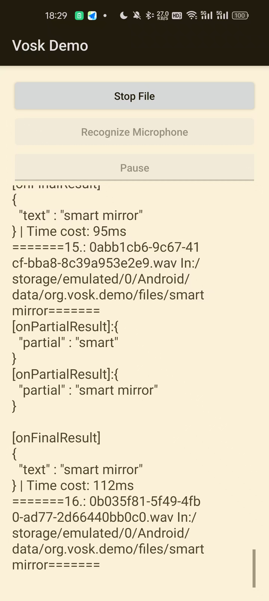

## 说明

此项目基于https://github.com/alphacep/vosk-android-demo实现。

为了验证对音频识别的准确度，可以将包含音频文件的文件加放置在外部存储的files目录下（/storage/emulated/0/Android/data/org.vosk.demo/files/）。

点击Recognize File将自动逐条对音频进行准确度以及速度进行分析，分析结果保存在recognition_logs/recognition_log.txt

## 测试记录

目前只测试了英语的识别效果。

Recognition Log:

=======1.: 007b3f76-b1a0-4c5c-aeb9-d9422a36f666.wav In:/storage/emulated/0/Android/data/org.vosk.demo/files/smart mirror=======

[onPartialResult]:{
  "partial" : "smart"
}

[onPartialResult]:{
  "partial" : "smart"
}
[onPartialResult]:{
  "partial" : "smart"
}
words:{
  "text" : "smart meter"
} | Time cost: 861ms

=======2.: 01142336-b732-4862-b8ce-e5ef526169c7.wav In:/storage/emulated/0/Android/data/org.vosk.demo/files/smart mirror=======
[onPartialResult]:{
  "partial" : "smart"
}
[onPartialResult]:{
  "partial" : "smart"
}
[onPartialResult]:{
  "partial" : "smart"
}
words:{
  "text" : "smart meter"
} | Time cost: 189ms

=======3.: 02067e8c-f1bd-400a-80c2-605afcb7778a.wav In:/storage/emulated/0/Android/data/org.vosk.demo/files/smart mirror=======
[onPartialResult]:{
  "partial" : "smart"
}
[onPartialResult]:{
  "partial" : "smart"
}
words:{
  "text" : "smart mirror"
} | Time cost: 181ms

=======4.: 0367ab5b-5c4b-4516-8eb0-a9a1d5c849be.wav In:/storage/emulated/0/Android/data/org.vosk.demo/files/smart mirror=======
[onPartialResult]:{
  "partial" : "smart"
}
[onPartialResult]:{
  "partial" : "smart mirror"
}
words:{
  "text" : "smart mirror"
} | Time cost: 153ms

=======5.: 052dba79-0092-467e-bdaf-540fc7abbce0.wav In:/storage/emulated/0/Android/data/org.vosk.demo/files/smart mirror=======
[onPartialResult]:{
  "partial" : "smart"
}
[onPartialResult]:{
  "partial" : "smart meter"
}
words:{
  "text" : "smart meter"
} | Time cost: 120ms

=======6.: 055d26e2-b89b-4726-8daf-d9151afc400e.wav In:/storage/emulated/0/Android/data/org.vosk.demo/files/smart mirror=======
[onPartialResult]:{
  "partial" : "smart"
}
[onPartialResult]:{
  "partial" : "smart"
}
[onPartialResult]:{
  "partial" : "smart"
}
words:{
  "text" : "smart meter"
} | Time cost: 117ms

=======7.: 0562ef94-cfa2-49c1-a30d-0d0b96e56f63.wav In:/storage/emulated/0/Android/data/org.vosk.demo/files/smart mirror=======
[onPartialResult]:{
  "partial" : "smart"
}
[onPartialResult]:{
  "partial" : "smart mirror"
}
words:{
  "text" : "smart mirror"
} | Time cost: 118ms

=======8.: 05a413f7-05d1-4fc8-aca7-9e4b4099ff77.wav In:/storage/emulated/0/Android/data/org.vosk.demo/files/smart mirror=======
[onPartialResult]:{
  "partial" : "smart man"
}
[onPartialResult]:{
  "partial" : "smart mirror"
}
words:{
  "text" : "smart mirror"
} | Time cost: 105ms

=======9.: 06718b3c-fb9f-400e-afb2-8080ec2ecfa1.wav In:/storage/emulated/0/Android/data/org.vosk.demo/files/smart mirror=======
[onPartialResult]:{
  "partial" : "smart"
}
[onPartialResult]:{
  "partial" : "smart"
}
words:{
  "text" : "smart mirror"
} | Time cost: 112ms

=======10.: 082eab86-54df-4cd8-ae07-6b749e89fcda.wav In:/storage/emulated/0/Android/data/org.vosk.demo/files/smart mirror=======
[onPartialResult]:{
  "partial" : "smart"
}
[onPartialResult]:{
  "partial" : "smart"
}
words:{
  "text" : "smart mirror"
} | Time cost: 106ms

=======11.: 087e2aae-8749-4d59-815d-fc7e6f7d904f.wav In:/storage/emulated/0/Android/data/org.vosk.demo/files/smart mirror=======
[onPartialResult]:{
  "partial" : "smart"
}
[onPartialResult]:{
  "partial" : "smart"
}
words:{
  "text" : "smart me"
} | Time cost: 110ms

=======12.: 0a3576a1-8a31-4e09-b340-474243fdf1c7.wav In:/storage/emulated/0/Android/data/org.vosk.demo/files/smart mirror=======
[onPartialResult]:{
  "partial" : "smart"
}
[onPartialResult]:{
  "partial" : "smart"
}
[onPartialResult]:{
  "partial" : "smart"
}
words:{
  "text" : "smart meter"
} | Time cost: 95ms

=======13.: 0a74dd57-3b71-426f-8f80-3e32aeecdf93.wav In:/storage/emulated/0/Android/data/org.vosk.demo/files/smart mirror=======
[onPartialResult]:{
  "partial" : "smart"
}
[onPartialResult]:{
  "partial" : "smart mirror"
}
words:{
  "text" : "smart mirror"
} | Time cost: 109ms

=======14.: 0a977721-6fae-4eae-baa0-434888e0c802.wav In:/storage/emulated/0/Android/data/org.vosk.demo/files/smart mirror=======
[onPartialResult]:{
  "partial" : "smart"
}
[onPartialResult]:{
  "partial" : "smart mirror"
}
words:{
  "text" : "smart mirror"
} | Time cost: 118ms

=======15.: 0abb1cb6-9c67-41cf-bba8-8c39a953e2e9.wav In:/storage/emulated/0/Android/data/org.vosk.demo/files/smart mirror=======
[onPartialResult]:{
  "partial" : "smart"
}
[onPartialResult]:{
  "partial" : "smart mirror"
}
words:{
  "text" : "smart mirror"
} | Time cost: 113ms

=======16.: 0b035f81-5f49-4fb0-ad77-2d66440bb0c0.wav In:/storage/emulated/0/Android/data/org.vosk.demo/files/smart mirror=======
[onPartialResult]:{
  "partial" : "smart"
}
[onPartialResult]:{
  "partial" : "smart meter"
}
words:{
  "text" : "smart meter"
} | Time cost: 272ms

=======17.: 0b7e8d79-e98c-43fd-816a-a65a297b229b.wav In:/storage/emulated/0/Android/data/org.vosk.demo/files/smart mirror=======
[onPartialResult]:{
  "partial" : "smart"
}
[onPartialResult]:{
  "partial" : "smart"
}
[onPartialResult]:{
  "partial" : "smart"
}
words:{
  "text" : "smart mirror"
} | Time cost: 109ms

=======18.: 0c656950-5d39-4db8-9553-9cf04b0d0b82.wav In:/storage/emulated/0/Android/data/org.vosk.demo/files/smart mirror=======
[onPartialResult]:{
  "partial" : "smart"
}
[onPartialResult]:{
  "partial" : "smart"
}
words:{
  "text" : "smart mirror"
} | Time cost: 89ms

=======19.: 0d80e328-c3e9-4dfb-9fc4-2e7fc76331a2.wav In:/storage/emulated/0/Android/data/org.vosk.demo/files/smart mirror=======
[onPartialResult]:{
  "partial" : "smart"
}
[onPartialResult]:{
  "partial" : "smart me"
}
words:{
  "text" : "smart me error"
} | Time cost: 107ms

=======20.: 0eefac6b-91a5-49a6-8bca-2e9bf0c6b477.wav In:/storage/emulated/0/Android/data/org.vosk.demo/files/smart mirror=======
[onPartialResult]:{
  "partial" : "smart"
}
[onPartialResult]:{
  "partial" : "smart mirror"
}
words:{
  "text" : "smart mirror"
} | Time cost: 96ms

=======21.: 105a7b70-2af2-4371-8140-ae5c52c1a604.wav In:/storage/emulated/0/Android/data/org.vosk.demo/files/smart mirror=======
[onPartialResult]:{
  "partial" : "smart"
}
[onPartialResult]:{
  "partial" : "smart"
}
[onPartialResult]:{
  "partial" : "smart"
}
words:{
  "text" : "smart mirror"
} | Time cost: 109ms

=======22.: 12788801-6cb9-448c-8946-bb0d7f957bce.wav In:/storage/emulated/0/Android/data/org.vosk.demo/files/smart mirror=======
[onPartialResult]:{
  "partial" : "smart"
}
[onPartialResult]:{
  "partial" : "smart"
}
words:{
  "text" : "smart mirror"
} | Time cost: 102ms

=======23.: 129dcb79-d684-4741-863b-e85a547c0922.wav In:/storage/emulated/0/Android/data/org.vosk.demo/files/smart mirror=======
[onPartialResult]:{
  "partial" : "smart"
}
[onPartialResult]:{
  "partial" : "smart meter"
}
words:{
  "text" : "smart meter"
} | Time cost: 107ms

=======24.: 13427b07-57ea-4f43-968f-1f97b51dfe5a.wav In:/storage/emulated/0/Android/data/org.vosk.demo/files/smart mirror=======
[onPartialResult]:{
  "partial" : "smart"
}
[onPartialResult]:{
  "partial" : "smart"
}
[onPartialResult]:{
  "partial" : "smart"
}
words:{
  "text" : "smart matter"
} | Time cost: 135ms

=======25.: 13c89176-f3cd-4c79-a131-02fceb5d3d6d.wav In:/storage/emulated/0/Android/data/org.vosk.demo/files/smart mirror=======
[onPartialResult]:{
  "partial" : "smart"
}
[onPartialResult]:{
  "partial" : "smart mirror"
}
words:{
  "text" : "smart mirror"
} | Time cost: 105ms

=======26.: 169e5ad5-ef13-4eda-be57-d0aecfc1e92c.wav In:/storage/emulated/0/Android/data/org.vosk.demo/files/smart mirror=======
[onPartialResult]:{
  "partial" : "smart"
}
[onPartialResult]:{
  "partial" : "smart mirror"
}
words:{
  "text" : "smart mirror"
} | Time cost: 107ms

=======27.: 17986a30-861c-43d1-9c07-b30554feae21.wav In:/storage/emulated/0/Android/data/org.vosk.demo/files/smart mirror=======
[onPartialResult]:{
  "partial" : "smart"
}
[onPartialResult]:{
  "partial" : "smart"
}
words:{
  "text" : "smart mirror"
} | Time cost: 112ms

=======28.: 17a51783-1c4c-410e-9af1-0e340c587eaf.wav In:/storage/emulated/0/Android/data/org.vosk.demo/files/smart mirror=======
[onPartialResult]:{
  "partial" : "smart"
}
[onPartialResult]:{
  "partial" : "smart mirror"
}
words:{
  "text" : "smart mirror"
} | Time cost: 104ms

=======29.: 17d8f0b4-f7c4-442c-b8eb-3e82ff0aaa76.wav In:/storage/emulated/0/Android/data/org.vosk.demo/files/smart mirror=======
[onPartialResult]:{
  "partial" : "smart"
}
[onPartialResult]:{
  "partial" : "smart"
}
words:{
  "text" : "smart mirror"
} | Time cost: 115ms

=======30.: 18911492-ef08-442d-8a30-5961e3b319f4.wav In:/storage/emulated/0/Android/data/org.vosk.demo/files/smart mirror=======
[onPartialResult]:{
  "partial" : "smart"
}
[onPartialResult]:{
  "partial" : "smart meter"
}
words:{
  "text" : "smart meter"
} | Time cost: 112ms

=======31.: 1a5cd0d2-ba5e-4d27-a042-49cd4650262c.wav In:/storage/emulated/0/Android/data/org.vosk.demo/files/smart mirror=======
[onPartialResult]:{
  "partial" : "smart"
}
[onPartialResult]:{
  "partial" : "smart"
}
words:{
  "text" : "smart me"
} | Time cost: 94ms

=======32.: 1ab430a2-a76c-47b9-8ac0-9a708ea0a8ed.wav In:/storage/emulated/0/Android/data/org.vosk.demo/files/smart mirror=======
[onPartialResult]:{
  "partial" : "smart"
}
[onPartialResult]:{
  "partial" : "smart mirror"
}
words:{
  "text" : "smart mirror"
} | Time cost: 107ms

=======33.: 1ad59cda-ccb0-4d0f-8704-38140d727a90.wav In:/storage/emulated/0/Android/data/org.vosk.demo/files/smart mirror=======
[onPartialResult]:{
  "partial" : "smart"
}
[onPartialResult]:{
  "partial" : "smart"
}
words:{
  "text" : "smart mirror"
} | Time cost: 107ms

=======34.: 1b6c71ce-59a0-4104-be98-8adc08b51230.wav In:/storage/emulated/0/Android/data/org.vosk.demo/files/smart mirror=======
[onPartialResult]:{
  "partial" : "smart"
}
[onPartialResult]:{
  "partial" : "smart"
}
[onPartialResult]:{
  "partial" : "smart"
}
words:{
  "text" : "smart mirror"
} | Time cost: 113ms

=======35.: 1cacb759-436f-42a4-97fb-3b5f682e7a71.wav In:/storage/emulated/0/Android/data/org.vosk.demo/files/smart mirror=======
[onPartialResult]:{
  "partial" : "smart"
}
[onPartialResult]:{
  "partial" : "smart"
}
words:{
  "text" : "smart mirror"
} | Time cost: 118ms

=======36.: 1de23cfc-9379-4df0-9415-2ba26ecf0984.wav In:/storage/emulated/0/Android/data/org.vosk.demo/files/smart mirror=======
[onPartialResult]:{
  "partial" : "smart"
}
[onPartialResult]:{
  "partial" : "smart meter"
}
words:{
  "text" : "smart meter"
} | Time cost: 113ms

=======37.: 1e3b4d38-f336-4c41-bbe4-2c98d2c73bfe.wav In:/storage/emulated/0/Android/data/org.vosk.demo/files/smart mirror=======
[onPartialResult]:{
  "partial" : "smart"
}
[onPartialResult]:{
  "partial" : "smart"
}
words:{
  "text" : "smart mirror"
} | Time cost: 145ms

=======38.: 1ed0ed8e-881f-4b54-9724-d0c2b81b0165.wav In:/storage/emulated/0/Android/data/org.vosk.demo/files/smart mirror=======
[onPartialResult]:{
  "partial" : "smart"
}
[onPartialResult]:{
  "partial" : "smart mirror"
}
words:{
  "text" : "smart mirror"
} | Time cost: 158ms

=======39.: 1fa7e130-4494-409a-9c58-f38d86360555.wav In:/storage/emulated/0/Android/data/org.vosk.demo/files/smart mirror=======
[onPartialResult]:{
  "partial" : "smart"
}
[onPartialResult]:{
  "partial" : "smart mirror"
}
words:{
  "text" : "smart mirror"
} | Time cost: 104ms

=======40.: 2022c1f7-d227-4d29-ae8a-0317afaeb41f.wav In:/storage/emulated/0/Android/data/org.vosk.demo/files/smart mirror=======
[onPartialResult]:{
  "partial" : "smart"
}
[onPartialResult]:{
  "partial" : "smart mirror"
}
words:{
  "text" : "smart mirror"
} | Time cost: 104ms

=======41.: 20abe8f6-85d4-4e14-9f52-c7eb519fadf8.wav In:/storage/emulated/0/Android/data/org.vosk.demo/files/smart mirror=======
[onPartialResult]:{
  "partial" : "smart man"
}
[onPartialResult]:{
  "partial" : "smart mirror"
}
words:{
  "text" : "smart mirror"
} | Time cost: 99ms

=======42.: 21823d64-5c3f-4d69-8328-03d211ad7bd7.wav In:/storage/emulated/0/Android/data/org.vosk.demo/files/smart mirror=======
[onPartialResult]:{
  "partial" : "smart murderer"
}
[onPartialResult]:{
  "partial" : "smart mirror"
}
words:{
  "text" : "smart mirror"
} | Time cost: 104ms

=======43.: 2311f046-bd6b-40b4-8560-0a2351d22450.wav In:/storage/emulated/0/Android/data/org.vosk.demo/files/smart mirror=======
[onPartialResult]:{
  "partial" : "smart"
}
[onPartialResult]:{
  "partial" : "smart murderer"
}
words:{
  "text" : "smart mirror"
} | Time cost: 96ms

=======44.: 246ab0dd-17e5-4567-9fbf-dad581893c78.wav In:/storage/emulated/0/Android/data/org.vosk.demo/files/smart mirror=======
[onPartialResult]:{
  "partial" : "smart"
}
[onPartialResult]:{
  "partial" : "smart meter"
}
words:{
  "text" : "smart meter"
} | Time cost: 110ms

=======45.: 24b6dbdd-feae-4063-8067-4531217c97df.wav In:/storage/emulated/0/Android/data/org.vosk.demo/files/smart mirror=======
[onPartialResult]:{
  "partial" : "smart"
}
[onPartialResult]:{
  "partial" : "smart"
}
words:{
  "text" : "smart me"
} | Time cost: 94ms

=======46.: 2684ec48-4f36-4530-8e89-643768c42af1.wav In:/storage/emulated/0/Android/data/org.vosk.demo/files/smart mirror=======
[onPartialResult]:{
  "partial" : "smart"
}
[onPartialResult]:{
  "partial" : "smart"
}
[onPartialResult]:{
  "partial" : "smart"
}
words:{
  "text" : "smart meter"
} | Time cost: 95ms

=======47.: 26a58ec0-1e56-4287-b406-a3b68fe2925c.wav In:/storage/emulated/0/Android/data/org.vosk.demo/files/smart mirror=======
[onPartialResult]:{
  "partial" : "smart"
}
[onPartialResult]:{
  "partial" : "smart mirror"
}
words:{
  "text" : "smart mirror"
} | Time cost: 102ms

=======48.: 280fb0b0-4c43-45f3-8b39-f01da0de6600.wav In:/storage/emulated/0/Android/data/org.vosk.demo/files/smart mirror=======
[onPartialResult]:{
  "partial" : "smart"
}
[onPartialResult]:{
  "partial" : "smart"
}
words:{
  "text" : "smart mirror"
} | Time cost: 102ms

=======49.: 2866e31f-ae6a-49db-a846-999823c4b498.wav In:/storage/emulated/0/Android/data/org.vosk.demo/files/smart mirror=======
[onPartialResult]:{
  "partial" : "smart"
}
[onPartialResult]:{
  "partial" : "smart"
}
words:{
  "text" : "smart mere"
} | Time cost: 108ms

=======50.: 292b897e-f5d0-49d7-8d4a-2913dfa0e691.wav In:/storage/emulated/0/Android/data/org.vosk.demo/files/smart mirror=======
[onPartialResult]:{
  "partial" : "smart"
}
[onPartialResult]:{
  "partial" : "smart"
}
words:{
  "text" : "smart mirror"
} | Time cost: 97ms

=======51.: 2c3279a4-f9ea-423c-93b3-c95db1951128.wav In:/storage/emulated/0/Android/data/org.vosk.demo/files/smart mirror=======
[onPartialResult]:{
  "partial" : "smart"
}
[onPartialResult]:{
  "partial" : "smart"
}
words:{
  "text" : "smart mirror"
} | Time cost: 104ms

=======52.: 2cd06863-aa81-4b97-bad1-85ddc25c3014.wav In:/storage/emulated/0/Android/data/org.vosk.demo/files/smart mirror=======
[onPartialResult]:{
  "partial" : "smart"
}
[onPartialResult]:{
  "partial" : "smart mirror"
}
words:{
  "text" : "smart mirror"
} | Time cost: 111ms

=======53.: 2d005b74-9c68-43a3-87f7-f83d8d626220.wav In:/storage/emulated/0/Android/data/org.vosk.demo/files/smart mirror=======
[onPartialResult]:{
  "partial" : "smart"
}
[onPartialResult]:{
  "partial" : "smart mirror"
}
words:{
  "text" : "smart mirror"
} | Time cost: 108ms

=======54.: 2db2b1f9-1f34-4084-8d09-c00b83236d2c.wav In:/storage/emulated/0/Android/data/org.vosk.demo/files/smart mirror=======
[onPartialResult]:{
  "partial" : "smart"
}
[onPartialResult]:{
  "partial" : "smart mirror"
}
words:{
  "text" : "smart mirror"
} | Time cost: 101ms

=======55.: 2dc9692b-4e7c-4a71-b6dc-d35ca5ac6393.wav In:/storage/emulated/0/Android/data/org.vosk.demo/files/smart mirror=======
[onPartialResult]:{
  "partial" : "smart"
}
[onPartialResult]:{
  "partial" : "smart mirror"
}
words:{
  "text" : "smart mirror"
} | Time cost: 105ms

=======56.: 2dec666f-9b05-46ec-8a96-86a7c2ed1a2a.wav In:/storage/emulated/0/Android/data/org.vosk.demo/files/smart mirror=======
[onPartialResult]:{
  "partial" : "smart"
}
[onPartialResult]:{
  "partial" : "smart"
}
words:{
  "text" : "smart mayor"
} | Time cost: 106ms

=======57.: 2e09ae9f-31c2-4f0c-a2a7-d11ae6a636d1.wav In:/storage/emulated/0/Android/data/org.vosk.demo/files/smart mirror=======
[onPartialResult]:{
  "partial" : "smart"
}
[onPartialResult]:{
  "partial" : "smart"
}
words:{
  "text" : "smart mirror"
} | Time cost: 110ms

=======58.: 2e27019b-9503-48e6-863c-aa5af04807ab.wav In:/storage/emulated/0/Android/data/org.vosk.demo/files/smart mirror=======
[onPartialResult]:{
  "partial" : "smart"
}
[onPartialResult]:{
  "partial" : "smart mirror"
}
words:{
  "text" : "smart mirror"
} | Time cost: 93ms

=======59.: 2e780c42-f89a-49ea-a0ae-3f12571055b6.wav In:/storage/emulated/0/Android/data/org.vosk.demo/files/smart mirror=======
[onPartialResult]:{
  "partial" : "smart"
}
[onPartialResult]:{
  "partial" : "smart"
}
[onPartialResult]:{
  "partial" : "smart murderer"
}
words:{
  "text" : "smart mirror"
} | Time cost: 118ms

=======60.: 2f4ebd66-ba04-4ddf-a221-81f9fe30fb57.wav In:/storage/emulated/0/Android/data/org.vosk.demo/files/smart mirror=======
[onPartialResult]:{
  "partial" : "smart"
}
[onPartialResult]:{
  "partial" : "smart"
}
words:{
  "text" : "smart mirror"
} | Time cost: 100ms

=======61.: 3078bf7a-5884-4e2c-9cfb-ea97e790abfe.wav In:/storage/emulated/0/Android/data/org.vosk.demo/files/smart mirror=======
[onPartialResult]:{
  "partial" : "smart"
}
[onPartialResult]:{
  "partial" : "smart"
}
words:{
  "text" : "smart mirror"
} | Time cost: 74ms

=======62.: 31181de2-efa2-45dc-99aa-358112b45f85.wav In:/storage/emulated/0/Android/data/org.vosk.demo/files/smart mirror=======
[onPartialResult]:{
  "partial" : "smart"
}
[onPartialResult]:{
  "partial" : "smart mirror"
}
words:{
  "text" : "smart mirror"
} | Time cost: 80ms

=======63.: 3158445c-646a-4efe-980b-b7222f1feede.wav In:/storage/emulated/0/Android/data/org.vosk.demo/files/smart mirror=======
[onPartialResult]:{
  "partial" : "smart"
}
[onPartialResult]:{
  "partial" : "smart mirror"
}
words:{
  "text" : "smart mirror"
} | Time cost: 118ms

=======64.: 317558a4-d88b-4c8f-9c80-006136f8f822.wav In:/storage/emulated/0/Android/data/org.vosk.demo/files/smart mirror=======
[onPartialResult]:{
  "partial" : "smart"
}
[onPartialResult]:{
  "partial" : "smart"
}
words:{
  "text" : "smart mirror"
} | Time cost: 104ms

=======65.: 326c02b1-dd55-446d-b9aa-6dbda36a3c31.wav In:/storage/emulated/0/Android/data/org.vosk.demo/files/smart mirror=======
[onPartialResult]:{
  "partial" : "smart"
}
[onPartialResult]:{
  "partial" : "smart mirror"
}
words:{
  "text" : "smart mirror"
} | Time cost: 96ms

=======66.: 32b3aad8-7420-4f25-9ffc-786e435d25aa.wav In:/storage/emulated/0/Android/data/org.vosk.demo/files/smart mirror=======
[onPartialResult]:{
  "partial" : "smart"
}
[onPartialResult]:{
  "partial" : "smart"
}
words:{
  "text" : "smart mirror"
} | Time cost: 91ms

=======67.: 334a4a1f-bae6-4cde-8ef5-1d3af6d32cb0.wav In:/storage/emulated/0/Android/data/org.vosk.demo/files/smart mirror=======
[onPartialResult]:{
  "partial" : "smart"
}
[onPartialResult]:{
  "partial" : "smart mirror"
}
words:{
  "text" : "smart mirror"
} | Time cost: 106ms

=======68.: 34387515-770c-4aba-9943-d027ffd0e142.wav In:/storage/emulated/0/Android/data/org.vosk.demo/files/smart mirror=======
[onPartialResult]:{
  "partial" : "smart"
}
[onPartialResult]:{
  "partial" : "smart mirror"
}
words:{
  "text" : "smart mirror"
} | Time cost: 102ms

=======69.: 34fcee33-fd8f-40ff-8664-b65bc2c90507.wav In:/storage/emulated/0/Android/data/org.vosk.demo/files/smart mirror=======
[onPartialResult]:{
  "partial" : "smart"
}
[onPartialResult]:{
  "partial" : "smart mirror"
}
words:{
  "text" : "smart mirror"
} | Time cost: 102ms

=======70.: 36c31f61-8330-451e-af7b-54866ef66339.wav In:/storage/emulated/0/Android/data/org.vosk.demo/files/smart mirror=======
[onPartialResult]:{
  "partial" : "smart"
}
[onPartialResult]:{
  "partial" : "smart mirror"
}
words:{
  "text" : "smart mirror"
} | Time cost: 95ms

=======71.: 37eef97f-1374-42c9-b691-f09d76d5d213.wav In:/storage/emulated/0/Android/data/org.vosk.demo/files/smart mirror=======
[onPartialResult]:{
  "partial" : "smart man"
}
[onPartialResult]:{
  "partial" : "smart mirror"
}
words:{
  "text" : "smart mirror"
} | Time cost: 103ms

=======72.: 3d165638-825a-489b-b198-a288c9763990.wav In:/storage/emulated/0/Android/data/org.vosk.demo/files/smart mirror=======
[onPartialResult]:{
  "partial" : "smart"
}
[onPartialResult]:{
  "partial" : "smart murderer"
}
words:{
  "text" : "smart meter"
} | Time cost: 113ms

=======73.: 3d220269-e660-442c-a9df-aeb9cf074cad.wav In:/storage/emulated/0/Android/data/org.vosk.demo/files/smart mirror=======
[onPartialResult]:{
  "partial" : "smart"
}
[onPartialResult]:{
  "partial" : "smart mirror"
}
words:{
  "text" : "smart mirror"
} | Time cost: 114ms

=======74.: 3ec79225-8ff0-4382-bbb4-3cfd35e5e9fc.wav In:/storage/emulated/0/Android/data/org.vosk.demo/files/smart mirror=======
[onPartialResult]:{
  "partial" : "smart"
}
[onPartialResult]:{
  "partial" : "smart mirror"
}
words:{
  "text" : "smart mirror"
} | Time cost: 89ms

=======75.: 40d3af4b-71b9-4385-b30d-5010e247ea4c.wav In:/storage/emulated/0/Android/data/org.vosk.demo/files/smart mirror=======
[onPartialResult]:{
  "partial" : "smart"
}
[onPartialResult]:{
  "partial" : "smart"
}
[onPartialResult]:{
  "partial" : "smart"
}
words:{
  "text" : "smart mirror"
} | Time cost: 104ms

=======76.: 418e6af4-3493-4439-b8a6-d1e8a2f1fb17.wav In:/storage/emulated/0/Android/data/org.vosk.demo/files/smart mirror=======
[onPartialResult]:{
  "partial" : "smart"
}
[onPartialResult]:{
  "partial" : "smart"
}
words:{
  "text" : "smart mere"
} | Time cost: 102ms

=======77.: 41c9a98d-81e2-4268-95f7-49c8eb734e6f.wav In:/storage/emulated/0/Android/data/org.vosk.demo/files/smart mirror=======
[onPartialResult]:{
  "partial" : "smart"
}
[onPartialResult]:{
  "partial" : "smart mirror"
}
words:{
  "text" : "smart mirror"
} | Time cost: 91ms

=======78.: 42cae4db-a4d0-4e79-9b61-3ec7c802838d.wav In:/storage/emulated/0/Android/data/org.vosk.demo/files/smart mirror=======
[onPartialResult]:{
  "partial" : "smart"
}
[onPartialResult]:{
  "partial" : "smart"
}
words:{
  "text" : "smart me"
} | Time cost: 88ms

=======79.: 463e0ece-07dd-400f-8cc7-16338940fe25.wav In:/storage/emulated/0/Android/data/org.vosk.demo/files/smart mirror=======
[onPartialResult]:{
  "partial" : "smart"
}
[onPartialResult]:{
  "partial" : "smart mirror"
}
words:{
  "text" : "smart mirror"
} | Time cost: 106ms

=======80.: 4922b3b1-d365-45ca-b4e4-2afd1632d44d.wav In:/storage/emulated/0/Android/data/org.vosk.demo/files/smart mirror=======
[onPartialResult]:{
  "partial" : "smart"
}
[onPartialResult]:{
  "partial" : "smart"
}
words:{
  "text" : "smart mirror"
} | Time cost: 99ms

=======81.: 49ec3059-0033-4949-b958-0b7b8c9fdef5.wav In:/storage/emulated/0/Android/data/org.vosk.demo/files/smart mirror=======
[onPartialResult]:{
  "partial" : "smart"
}
[onPartialResult]:{
  "partial" : "smart"
}
[onPartialResult]:{
  "partial" : "smart"
}
words:{
  "text" : "smart mirror"
} | Time cost: 100ms

=======82.: 4d30d474-955d-406a-aa1f-74a1493e4e64.wav In:/storage/emulated/0/Android/data/org.vosk.demo/files/smart mirror=======
[onPartialResult]:{
  "partial" : "my"
}
[onPartialResult]:{
  "partial" : "my"
}
words:{
  "text" : "my meter"
} | Time cost: 154ms

=======83.: 4df6ae39-a00f-411a-bfe4-74d7601de431.wav In:/storage/emulated/0/Android/data/org.vosk.demo/files/smart mirror=======
[onPartialResult]:{
  "partial" : "smart"
}
[onPartialResult]:{
  "partial" : "smart mirror"
}
words:{
  "text" : "smart mirror"
} | Time cost: 107ms

=======84.: 4f3f58b6-ea4c-443d-b675-757056e25586.wav In:/storage/emulated/0/Android/data/org.vosk.demo/files/smart mirror=======
[onPartialResult]:{
  "partial" : "smart"
}
[onPartialResult]:{
  "partial" : "smart"
}
[onPartialResult]:{
  "partial" : "small"
}
words:{
  "text" : "small matter"
} | Time cost: 127ms

=======85.: 4ff31576-e087-4844-8314-0857bf32db19.wav In:/storage/emulated/0/Android/data/org.vosk.demo/files/smart mirror=======
[onPartialResult]:{
  "partial" : "smart"
}
[onPartialResult]:{
  "partial" : "smart mirror"
}
words:{
  "text" : "smart mirror"
} | Time cost: 108ms

=======86.: 50e0f56d-6d0b-4c9c-b3be-aa14b87ce89e.wav In:/storage/emulated/0/Android/data/org.vosk.demo/files/smart mirror=======
[onPartialResult]:{
  "partial" : "smart"
}
[onPartialResult]:{
  "partial" : "smart mirror"
}
words:{
  "text" : "smart mirror"
} | Time cost: 113ms

=======87.: 53e1feae-3b9b-4092-81a2-e4afb4064d38.wav In:/storage/emulated/0/Android/data/org.vosk.demo/files/smart mirror=======
[onPartialResult]:{
  "partial" : "smart"
}
[onPartialResult]:{
  "partial" : "smart mirror"
}
words:{
  "text" : "smart mirror"
} | Time cost: 108ms

=======88.: 57097a7d-f00b-4128-961e-5483add91a1e.wav In:/storage/emulated/0/Android/data/org.vosk.demo/files/smart mirror=======
[onPartialResult]:{
  "partial" : "smart"
}
[onPartialResult]:{
  "partial" : "smart"
}
[onPartialResult]:{
  "partial" : "smart"
}
words:{
  "text" : "smart mirror"
} | Time cost: 102ms

=======89.: 5a9529fc-ee2f-4b50-9f19-721d723134d8.wav In:/storage/emulated/0/Android/data/org.vosk.demo/files/smart mirror=======
[onPartialResult]:{
  "partial" : "smart"
}
[onPartialResult]:{
  "partial" : "smart mirror"
}
words:{
  "text" : "smart mirror"
} | Time cost: 117ms

=======90.: 5b35c919-b567-4f7f-8075-fa4de93ee163.wav In:/storage/emulated/0/Android/data/org.vosk.demo/files/smart mirror=======
[onPartialResult]:{
  "partial" : "smart"
}
[onPartialResult]:{
  "partial" : "smart mirror"
}
words:{
  "text" : "smart mirror"
} | Time cost: 110ms

=======91.: 5bc6e1ef-a738-412d-a023-28bc037f677d.wav In:/storage/emulated/0/Android/data/org.vosk.demo/files/smart mirror=======
[onPartialResult]:{
  "partial" : "smart"
}
[onPartialResult]:{
  "partial" : "smart mirror"
}
words:{
  "text" : "smart mirror"
} | Time cost: 105ms

=======92.: 5d736985-4e25-4569-9619-7f418be417c1.wav In:/storage/emulated/0/Android/data/org.vosk.demo/files/smart mirror=======
[onPartialResult]:{
  "partial" : "smart"
}
[onPartialResult]:{
  "partial" : "smart"
}
words:{
  "text" : "smart mirror"
} | Time cost: 111ms

=======93.: 5eeb884b-8085-43cb-b080-27b1ebc0ef65.wav In:/storage/emulated/0/Android/data/org.vosk.demo/files/smart mirror=======
[onPartialResult]:{
  "partial" : "smart"
}
[onPartialResult]:{
  "partial" : "smart"
}
words:{
  "text" : "smart mere"
} | Time cost: 114ms

=======94.: 5f0c4fc2-b951-4f1b-9105-fa7566e943f5.wav In:/storage/emulated/0/Android/data/org.vosk.demo/files/smart mirror=======
[onPartialResult]:{
  "partial" : "smart"
}
[onPartialResult]:{
  "partial" : "smart"
}
words:{
  "text" : "smart mirror"
} | Time cost: 112ms

=======95.: 60855575-5129-4ddc-9ace-9cb05806cd0a.wav In:/storage/emulated/0/Android/data/org.vosk.demo/files/smart mirror=======
[onPartialResult]:{
  "partial" : "smart"
}
[onPartialResult]:{
  "partial" : "smart"
}
words:{
  "text" : "smart mirror"
} | Time cost: 95ms

=======96.: 6244fc0d-6a93-42aa-9228-322579806e49.wav In:/storage/emulated/0/Android/data/org.vosk.demo/files/smart mirror=======
[onPartialResult]:{
  "partial" : "smart"
}
[onPartialResult]:{
  "partial" : "smart"
}
words:{
  "text" : "smart mirror"
} | Time cost: 105ms

=======97.: 64ae9458-0dac-4cef-a0f6-2e6361792fd2.wav In:/storage/emulated/0/Android/data/org.vosk.demo/files/smart mirror=======
[onPartialResult]:{
  "partial" : "smart"
}
[onPartialResult]:{
  "partial" : "smart"
}
[onPartialResult]:{
  "partial" : "smart mirror"
}
words:{
  "text" : "smart mirror"
} | Time cost: 116ms

=======98.: 64bbb93d-7f39-4033-a26c-4b224d2d6825.wav In:/storage/emulated/0/Android/data/org.vosk.demo/files/smart mirror=======
[onPartialResult]:{
  "partial" : "smart"
}
[onPartialResult]:{
  "partial" : "smart"
}
words:{
  "text" : "smart mere"
} | Time cost: 69ms

=======99.: 65998d34-ec83-4c01-8cdf-b42892788fb0.wav In:/storage/emulated/0/Android/data/org.vosk.demo/files/smart mirror=======
[onPartialResult]:{
  "partial" : "smart"
}
[onPartialResult]:{
  "partial" : "smart"
}
[onPartialResult]:{
  "partial" : "smart"
}
words:{
  "text" : "smart mirror"
} | Time cost: 110ms

=======100.: 661e49b5-8f15-432e-8577-4bd631e48206.wav In:/storage/emulated/0/Android/data/org.vosk.demo/files/smart mirror=======
[onPartialResult]:{
  "partial" : "smart"
}
[onPartialResult]:{
  "partial" : "smart mirror"
}
words:{
  "text" : "smart mirror"
} | Time cost: 122ms

=======101.: 6691a120-c61a-4b74-8952-204ea90caff4.wav In:/storage/emulated/0/Android/data/org.vosk.demo/files/smart mirror=======
[onPartialResult]:{
  "partial" : "smart"
}
[onPartialResult]:{
  "partial" : "smart"
}
[onPartialResult]:{
  "partial" : "smart"
}
words:{
  "text" : "smart meter"
} | Time cost: 98ms

=======102.: 6867412c-93ea-4534-b188-50b8d8348cb9.wav In:/storage/emulated/0/Android/data/org.vosk.demo/files/smart mirror=======
[onPartialResult]:{
  "partial" : "smart"
}
[onPartialResult]:{
  "partial" : "smart mirror"
}
words:{
  "text" : "smart mirror"
} | Time cost: 118ms

=======103.: 6b102f6a-4f67-4728-946c-0a4f0db2f56d.wav In:/storage/emulated/0/Android/data/org.vosk.demo/files/smart mirror=======
[onPartialResult]:{
  "partial" : "smart"
}
[onPartialResult]:{
  "partial" : "smart mirror"
}
words:{
  "text" : "smart mirror"
} | Time cost: 111ms

=======104.: 6b8cf45a-ff80-4ba5-a9d2-9fb24b93ba9e.wav In:/storage/emulated/0/Android/data/org.vosk.demo/files/smart mirror=======
[onPartialResult]:{
  "partial" : "smart"
}
[onPartialResult]:{
  "partial" : "smart"
}
[onPartialResult]:{
  "partial" : "smart man"
}
words:{
  "text" : "smart matter"
} | Time cost: 119ms

=======105.: 6c17ed09-0bbb-4e7e-902d-3bc063b9da09.wav In:/storage/emulated/0/Android/data/org.vosk.demo/files/smart mirror=======
[onPartialResult]:{
  "partial" : "smart"
}
[onPartialResult]:{
  "partial" : "smart mirror"
}
words:{
  "text" : "smart mirror"
} | Time cost: 100ms

=======106.: 6d1200e5-793b-44c5-8549-761cd7c5e5d3.wav In:/storage/emulated/0/Android/data/org.vosk.demo/files/smart mirror=======
[onPartialResult]:{
  "partial" : "smart"
}
[onPartialResult]:{
  "partial" : "smart"
}
words:{
  "text" : "smart mirror"
} | Time cost: 86ms

=======107.: 6de96bc0-5439-4fa4-812e-b2390463869a.wav In:/storage/emulated/0/Android/data/org.vosk.demo/files/smart mirror=======
[onPartialResult]:{
  "partial" : "smart"
}
[onPartialResult]:{
  "partial" : "smart mirror"
}
words:{
  "text" : "smart mirror"
} | Time cost: 94ms

=======108.: 7014b329-aa7a-43ba-b97f-613b7b851d51.wav In:/storage/emulated/0/Android/data/org.vosk.demo/files/smart mirror=======
[onPartialResult]:{
  "partial" : "smart"
}
[onPartialResult]:{
  "partial" : "smart mirror"
}
words:{
  "text" : "smart mirror"
} | Time cost: 112ms

=======109.: 7098fe50-a0df-4689-a8f9-d95b0f64d9c9.wav In:/storage/emulated/0/Android/data/org.vosk.demo/files/smart mirror=======
[onPartialResult]:{
  "partial" : "smart"
}
[onPartialResult]:{
  "partial" : "smart"
}
words:{
  "text" : "smart mere"
} | Time cost: 112ms

=======110.: 733bbb2f-0dee-4a47-9030-3459ae1f9acc.wav In:/storage/emulated/0/Android/data/org.vosk.demo/files/smart mirror=======
[onPartialResult]:{
  "partial" : "smart"
}
[onPartialResult]:{
  "partial" : "smart mirror"
}
words:{
  "text" : "smart mirror"
} | Time cost: 121ms

=======111.: 757cb927-a1b0-41bf-b071-b3128fa74c1e.wav In:/storage/emulated/0/Android/data/org.vosk.demo/files/smart mirror=======
[onPartialResult]:{
  "partial" : "smoke mirrors"
}
[onPartialResult]:{
  "partial" : "smart mirror"
}
words:{
  "text" : "smart mirror"
} | Time cost: 107ms

=======112.: 7649cfff-37c4-44eb-8eb9-920516cc287c.wav In:/storage/emulated/0/Android/data/org.vosk.demo/files/smart mirror=======
[onPartialResult]:{
  "partial" : "smart"
}
[onPartialResult]:{
  "partial" : "smart mirror"
}
words:{
  "text" : "smart mirror"
} | Time cost: 122ms

=======113.: 77efc2dd-7bfc-4352-937f-b111e3c6e764.wav In:/storage/emulated/0/Android/data/org.vosk.demo/files/smart mirror=======
[onPartialResult]:{
  "partial" : "smart"
}
[onPartialResult]:{
  "partial" : "smart"
}
words:{
  "text" : "smart mirror"
} | Time cost: 95ms

=======114.: 7869867b-f746-4a94-82f7-d35c8be75b4d.wav In:/storage/emulated/0/Android/data/org.vosk.demo/files/smart mirror=======
[onPartialResult]:{
  "partial" : "smart"
}
[onPartialResult]:{
  "partial" : "smart mirror"
}
words:{
  "text" : "smart mirror"
} | Time cost: 120ms

=======115.: 792e48a9-3545-4f87-a24c-605003a8d7e6.wav In:/storage/emulated/0/Android/data/org.vosk.demo/files/smart mirror=======
[onPartialResult]:{
  "partial" : "smart"
}
[onPartialResult]:{
  "partial" : "smart"
}
words:{
  "text" : "smart mere"
} | Time cost: 115ms

=======116.: 7bae2633-93b3-4ad6-aabd-f38a10d21872.wav In:/storage/emulated/0/Android/data/org.vosk.demo/files/smart mirror=======
[onPartialResult]:{
  "partial" : "smart"
}
[onPartialResult]:{
  "partial" : "smart mirror"
}
words:{
  "text" : "smart mirror"
} | Time cost: 108ms

=======117.: 7f0ac67b-ea9f-41c4-bf4d-1194a4e6bcb3.wav In:/storage/emulated/0/Android/data/org.vosk.demo/files/smart mirror=======
[onPartialResult]:{
  "partial" : "smart"
}
[onPartialResult]:{
  "partial" : "smart mirror"
}
words:{
  "text" : "smart mirror"
} | Time cost: 106ms

=======118.: 7fe67fc0-fd96-4d95-9339-3f5636954463.wav In:/storage/emulated/0/Android/data/org.vosk.demo/files/smart mirror=======
[onPartialResult]:{
  "partial" : "smite"
}
[onPartialResult]:{
  "partial" : "smite"
}
words:{
  "text" : "smite mirror"
} | Time cost: 90ms

=======119.: 8007a841-7c1a-4f1f-86a1-6e12961482d8.wav In:/storage/emulated/0/Android/data/org.vosk.demo/files/smart mirror=======
[onPartialResult]:{
  "partial" : "smart"
}
[onPartialResult]:{
  "partial" : "smart"
}
words:{
  "text" : "smart mirror"
} | Time cost: 111ms

=======120.: 8055c1b0-f50a-452a-bde1-0f836b02d765.wav In:/storage/emulated/0/Android/data/org.vosk.demo/files/smart mirror=======
[onPartialResult]:{
  "partial" : "smart"
}
[onPartialResult]:{
  "partial" : "smart narrow"
}
words:{
  "text" : "smart mirror"
} | Time cost: 98ms

=======121.: 80683802-a589-4d70-b86c-22ba283b157e.wav In:/storage/emulated/0/Android/data/org.vosk.demo/files/smart mirror=======
[onPartialResult]:{
  "partial" : "smart"
}
[onPartialResult]:{
  "partial" : "smart"
}
words:{
  "text" : "smart mere"
} | Time cost: 126ms

=======122.: 80e25f11-ec68-489a-a350-6413b1b8b196.wav In:/storage/emulated/0/Android/data/org.vosk.demo/files/smart mirror=======
[onPartialResult]:{
  "partial" : "smart"
}
[onPartialResult]:{
  "partial" : "smart"
}
words:{
  "text" : "smart mirror"
} | Time cost: 101ms

=======123.: 81b62a66-634b-45c2-a4d1-4b0d352aaa85.wav In:/storage/emulated/0/Android/data/org.vosk.demo/files/smart mirror=======
[onPartialResult]:{
  "partial" : "smart"
}
[onPartialResult]:{
  "partial" : "smart"
}
words:{
  "text" : "smart mere"
} | Time cost: 108ms

=======124.: 853aa0ed-ded9-4074-b147-2b1265014dae.wav In:/storage/emulated/0/Android/data/org.vosk.demo/files/smart mirror=======
[onPartialResult]:{
  "partial" : "smart"
}
[onPartialResult]:{
  "partial" : "smart a mirror"
}
words:{
  "text" : "smart a mirror"
} | Time cost: 145ms

=======125.: 866d3bf3-50f4-4fa7-8774-500da82afe75.wav In:/storage/emulated/0/Android/data/org.vosk.demo/files/smart mirror=======
[onPartialResult]:{
  "partial" : "smart"
}
[onPartialResult]:{
  "partial" : "smart"
}
words:{
  "text" : "smart mirror"
} | Time cost: 105ms

=======126.: 87f843a7-30a1-43a9-917f-b0ad458d5600.wav In:/storage/emulated/0/Android/data/org.vosk.demo/files/smart mirror=======
[onPartialResult]:{
  "partial" : "smart"
}
[onPartialResult]:{
  "partial" : "smart"
}
words:{
  "text" : "smart mirror"
} | Time cost: 107ms

=======127.: 882fdc9d-fc43-46c7-b11d-fa82fd2ae027.wav In:/storage/emulated/0/Android/data/org.vosk.demo/files/smart mirror=======
[onPartialResult]:{
  "partial" : "smart"
}
[onPartialResult]:{
  "partial" : "smart"
}
words:{
  "text" : "smart mere"
} | Time cost: 120ms

=======128.: 89db4cc7-4496-47c8-9362-b6d2f6054b9f.wav In:/storage/emulated/0/Android/data/org.vosk.demo/files/smart mirror=======
[onPartialResult]:{
  "partial" : "smart"
}
[onPartialResult]:{
  "partial" : "smart mirror"
}
words:{
  "text" : "smart mirror"
} | Time cost: 104ms

=======129.: 8b0ebee5-5bb0-4db0-8bec-913dc53994ce.wav In:/storage/emulated/0/Android/data/org.vosk.demo/files/smart mirror=======
[onPartialResult]:{
  "partial" : "smart"
}
[onPartialResult]:{
  "partial" : "smart me"
}
words:{
  "text" : "smart me here"
} | Time cost: 91ms

=======130.: 8c1daba4-1c18-4ecf-b23a-1cc57abde2a5.wav In:/storage/emulated/0/Android/data/org.vosk.demo/files/smart mirror=======
[onPartialResult]:{
  "partial" : "smart"
}
[onPartialResult]:{
  "partial" : "smart mira"
}
words:{
  "text" : "smart mirror"
} | Time cost: 113ms

=======131.: 8d5f3acf-86ca-4d2d-b588-a22cfd9cd190.wav In:/storage/emulated/0/Android/data/org.vosk.demo/files/smart mirror=======
[onPartialResult]:{
  "partial" : "smart"
}
[onPartialResult]:{
  "partial" : "smart"
}
words:{
  "text" : "smart mirror"
} | Time cost: 102ms

=======132.: 8d6dabba-1e27-4617-8fdf-1a94ce2c240a.wav In:/storage/emulated/0/Android/data/org.vosk.demo/files/smart mirror=======
[onPartialResult]:{
  "partial" : "smart mirror"
}
[onPartialResult]:{
  "partial" : "smart mirror"
}
words:{
  "text" : "smart mirror"
} | Time cost: 122ms

=======133.: 8e8a6bee-90a5-4dcb-b041-a56ed22df290.wav In:/storage/emulated/0/Android/data/org.vosk.demo/files/smart mirror=======
[onPartialResult]:{
  "partial" : "smart"
}
[onPartialResult]:{
  "partial" : "smart"
}
words:{
  "text" : "smart mean"
} | Time cost: 92ms

=======134.: 8f13ecb6-3d16-4fb4-ac2b-aabba1cf1b5e.wav In:/storage/emulated/0/Android/data/org.vosk.demo/files/smart mirror=======
[onPartialResult]:{
  "partial" : "smart"
}
[onPartialResult]:{
  "partial" : "smart mirror"
}
words:{
  "text" : "smart mirror"
} | Time cost: 115ms

=======135.: 92952064-17f9-4e32-ba44-29ae235c1eec.wav In:/storage/emulated/0/Android/data/org.vosk.demo/files/smart mirror=======
[onPartialResult]:{
  "partial" : "smart"
}
[onPartialResult]:{
  "partial" : "smart"
}
words:{
  "text" : "smart mirror"
} | Time cost: 95ms

=======136.: 94ab875d-0a59-4394-9e94-fe15f67281e2.wav In:/storage/emulated/0/Android/data/org.vosk.demo/files/smart mirror=======
[onPartialResult]:{
  "partial" : "smart"
}
[onPartialResult]:{
  "partial" : "smart"
}
[onPartialResult]:{
  "partial" : "smart"
}
words:{
  "text" : "smart mirror"
} | Time cost: 110ms

=======137.: 97437eb3-ce5e-4f21-8b73-503faabb1546.wav In:/storage/emulated/0/Android/data/org.vosk.demo/files/smart mirror=======
[onPartialResult]:{
  "partial" : "smart"
}
[onPartialResult]:{
  "partial" : "smart"
}
words:{
  "text" : "smart mirror"
} | Time cost: 103ms

=======138.: 9782acd8-4b3c-4c3f-a206-ef12935eed4e.wav In:/storage/emulated/0/Android/data/org.vosk.demo/files/smart mirror=======
[onPartialResult]:{
  "partial" : "smart"
}
[onPartialResult]:{
  "partial" : "smart"
}
words:{
  "text" : "smart mirror"
} | Time cost: 108ms

=======139.: 99310638-4b3c-42a6-a573-77fff9051afb.wav In:/storage/emulated/0/Android/data/org.vosk.demo/files/smart mirror=======
[onPartialResult]:{
  "partial" : "smart"
}
[onPartialResult]:{
  "partial" : "smart mirror"
}
words:{
  "text" : "smart mirror"
} | Time cost: 109ms

=======140.: 99e1c5ac-c44c-4e57-a2a1-99112c38eb8f.wav In:/storage/emulated/0/Android/data/org.vosk.demo/files/smart mirror=======
[onPartialResult]:{
  "partial" : "smart"
}
[onPartialResult]:{
  "partial" : "smart mirror"
}
words:{
  "text" : "smart mirror"
} | Time cost: 100ms

=======141.: 37edccb8-e83d-4ad6-96aa-36d2a99b6d74.wav In:/storage/emulated/0/Android/data/org.vosk.demo/files/smart mirror=======
[onPartialResult]:{
  "partial" : "smart"
}
[onPartialResult]:{
  "partial" : "smart me"
}
words:{
  "text" : "smart mirror"
} | Time cost: 119ms

=======142.: 3a1e9cab-fadd-4a69-b625-f359b5cb2b9b.wav In:/storage/emulated/0/Android/data/org.vosk.demo/files/smart mirror=======
[onPartialResult]:{
  "partial" : "smart"
}
[onPartialResult]:{
  "partial" : "smart"
}
[onPartialResult]:{
  "partial" : "smart"
}
words:{
  "text" : "smart mirror"
} | Time cost: 115ms

=======143.: 3ab5893d-344e-4ee5-9480-5c7a682e54e3.wav In:/storage/emulated/0/Android/data/org.vosk.demo/files/smart mirror=======
[onPartialResult]:{
  "partial" : "smart"
}
[onPartialResult]:{
  "partial" : "smart mirror"
}
words:{
  "text" : "smart mirror"
} | Time cost: 93ms

=======144.: 3c65b905-5b8d-43d9-87ab-35d3caf06e82.wav In:/storage/emulated/0/Android/data/org.vosk.demo/files/smart mirror=======
[onPartialResult]:{
  "partial" : "smart"
}
[onPartialResult]:{
  "partial" : "smart mirror"
}
words:{
  "text" : "smart mirror"
} | Time cost: 111ms

=======145.: 3deb24b9-baf4-4f1c-9d75-e225a936a73a.wav In:/storage/emulated/0/Android/data/org.vosk.demo/files/smart mirror=======
[onPartialResult]:{
  "partial" : "smart"
}
[onPartialResult]:{
  "partial" : "smart mirror"
}
words:{
  "text" : "smart mirror"
} | Time cost: 103ms

=======146.: 4005fdf4-68b6-4e70-8056-03b19667028d.wav In:/storage/emulated/0/Android/data/org.vosk.demo/files/smart mirror=======
[onPartialResult]:{
  "partial" : "smart"
}
[onPartialResult]:{
  "partial" : "smart"
}
[onPartialResult]:{
  "partial" : "smart murderer"
}
words:{
  "text" : "smart matter"
} | Time cost: 107ms

=======147.: 43351229-33af-4e6e-abd6-2c6b0f5e470d.wav In:/storage/emulated/0/Android/data/org.vosk.demo/files/smart mirror=======
[onPartialResult]:{
  "partial" : "smart man"
}
[onPartialResult]:{
  "partial" : "smart mirror"
}
words:{
  "text" : "smart mirror"
} | Time cost: 114ms

=======148.: 4377963f-b933-4aba-b071-eed20bc96d19.wav In:/storage/emulated/0/Android/data/org.vosk.demo/files/smart mirror=======
[onPartialResult]:{
  "partial" : "smart"
}
[onPartialResult]:{
  "partial" : "smart"
}
words:{
  "text" : "smart man"
} | Time cost: 103ms

=======149.: 43b15490-7cc4-4d94-927f-91cb6c5cae33.wav In:/storage/emulated/0/Android/data/org.vosk.demo/files/smart mirror=======
[onPartialResult]:{
  "partial" : "smart"
}
[onPartialResult]:{
  "partial" : "smart"
}
words:{
  "text" : "smart mirror"
} | Time cost: 110ms

=======150.: 459e3810-db95-4691-a602-5526253301ba.wav In:/storage/emulated/0/Android/data/org.vosk.demo/files/smart mirror=======
[onPartialResult]:{
  "partial" : "smart"
}
[onPartialResult]:{
  "partial" : "smart"
}
words:{
  "text" : "smart mirror"
} | Time cost: 98ms

=======151.: 46b5b7da-9b67-46ae-99df-0b8861e4e87a.wav In:/storage/emulated/0/Android/data/org.vosk.demo/files/smart mirror=======
[onPartialResult]:{
  "partial" : "smart"
}
[onPartialResult]:{
  "partial" : "smart"
}
[onPartialResult]:{
  "partial" : "smart man"
}
words:{
  "text" : "smart matter"
} | Time cost: 113ms

=======152.: 46f27afa-c5ea-448b-b3b8-6cb30c2c64e3.wav In:/storage/emulated/0/Android/data/org.vosk.demo/files/smart mirror=======
[onPartialResult]:{
  "partial" : "smart"
}
[onPartialResult]:{
  "partial" : "smart"
}
[onPartialResult]:{
  "partial" : "smart man"
}
words:{
  "text" : "smart matter"
} | Time cost: 122ms

=======153.: 479115b8-53d1-4286-b003-6923b0680a62.wav In:/storage/emulated/0/Android/data/org.vosk.demo/files/smart mirror=======
[onPartialResult]:{
  "partial" : "smart"
}
[onPartialResult]:{
  "partial" : "smart"
}
[onPartialResult]:{
  "partial" : "smart"
}
words:{
  "text" : "smart mirror"
} | Time cost: 98ms

=======154.: 48d2fe5e-c16a-4893-8e24-87aea386a298.wav In:/storage/emulated/0/Android/data/org.vosk.demo/files/smart mirror=======
[onPartialResult]:{
  "partial" : "smart"
}
[onPartialResult]:{
  "partial" : "smart me"
}
words:{
  "text" : "smart me air"
} | Time cost: 84ms

=======155.: 4c20e0b6-b8e3-4f5c-9cbd-3ad92d80acf5.wav In:/storage/emulated/0/Android/data/org.vosk.demo/files/smart mirror=======
[onPartialResult]:{
  "partial" : "smart"
}
[onPartialResult]:{
  "partial" : "smart mirror"
}
words:{
  "text" : "smart mirror"
} | Time cost: 112ms

=======156.: 4c724e9c-ac9d-438e-9bbf-cba074940c38.wav In:/storage/emulated/0/Android/data/org.vosk.demo/files/smart mirror=======
[onPartialResult]:{
  "partial" : "smart"
}
[onPartialResult]:{
  "partial" : "smart"
}
[onPartialResult]:{
  "partial" : "smart mirror"
}
words:{
  "text" : "smart mirror"
} | Time cost: 108ms

=======157.: 4dbfccbc-2aba-4953-a15a-436610084095.wav In:/storage/emulated/0/Android/data/org.vosk.demo/files/smart mirror=======
[onPartialResult]:{
  "partial" : "smart"
}
[onPartialResult]:{
  "partial" : "smart mirror"
}
words:{
  "text" : "smart mirror"
} | Time cost: 106ms

=======158.: 50422a64-dbbb-45d4-a861-bf2e8bd92758.wav In:/storage/emulated/0/Android/data/org.vosk.demo/files/smart mirror=======
[onPartialResult]:{
  "partial" : "smart"
}
[onPartialResult]:{
  "partial" : "smart"
}
words:{
  "text" : "smart me"
} | Time cost: 94ms

=======159.: 525c0e29-6783-488f-9068-8ab7c05693ba.wav In:/storage/emulated/0/Android/data/org.vosk.demo/files/smart mirror=======
[onPartialResult]:{
  "partial" : "smart"
}
[onPartialResult]:{
  "partial" : "smart mirror"
}
words:{
  "text" : "smart mirror"
} | Time cost: 112ms

=======160.: 53cfc71b-a341-43e3-ba84-c3c64166c861.wav In:/storage/emulated/0/Android/data/org.vosk.demo/files/smart mirror=======
[onPartialResult]:{
  "partial" : "smart"
}
[onPartialResult]:{
  "partial" : "smart mirror"
}
words:{
  "text" : "smite mirror"
} | Time cost: 96ms

=======161.: 552013a3-4a14-48d4-bb72-b24199712a38.wav In:/storage/emulated/0/Android/data/org.vosk.demo/files/smart mirror=======
[onPartialResult]:{
  "partial" : "smart"
}
[onPartialResult]:{
  "partial" : "smart meter"
}
words:{
  "text" : "smart meter"
} | Time cost: 112ms

=======162.: 569e7520-9be7-4aaf-82bc-0207aec32726.wav In:/storage/emulated/0/Android/data/org.vosk.demo/files/smart mirror=======
[onPartialResult]:{
  "partial" : "smart"
}
[onPartialResult]:{
  "partial" : "smart mirror"
}
words:{
  "text" : "smart mirror"
} | Time cost: 108ms

=======163.: 56a976f6-7562-433d-a02d-5a5dd2caaf84.wav In:/storage/emulated/0/Android/data/org.vosk.demo/files/smart mirror=======
[onPartialResult]:{
  "partial" : "smart"
}
[onPartialResult]:{
  "partial" : "smart"
}
[onPartialResult]:{
  "partial" : "smart"
}
words:{
  "text" : "smart meter"
} | Time cost: 93ms

=======164.: 582727a3-3fe8-4100-a4f5-8f0c6c4d6b10.wav In:/storage/emulated/0/Android/data/org.vosk.demo/files/smart mirror=======
[onPartialResult]:{
  "partial" : "smart"
}
[onPartialResult]:{
  "partial" : "smart mirror"
}
words:{
  "text" : "smart mirror"
} | Time cost: 108ms

=======165.: 595c796d-c937-44e6-b1b5-260d0a23db40.wav In:/storage/emulated/0/Android/data/org.vosk.demo/files/smart mirror=======
[onPartialResult]:{
  "partial" : "smart"
}
[onPartialResult]:{
  "partial" : "smart mirror"
}
words:{
  "text" : "smart mirror"
} | Time cost: 113ms

=======166.: 599834f1-61dc-41d4-aa00-00485b9917ef.wav In:/storage/emulated/0/Android/data/org.vosk.demo/files/smart mirror=======
[onPartialResult]:{
  "partial" : "smart"
}
[onPartialResult]:{
  "partial" : "smart"
}
words:{
  "text" : "smart mere"
} | Time cost: 112ms

=======167.: 5a2c5eaa-ed64-4a61-b418-8ee9b55feae5.wav In:/storage/emulated/0/Android/data/org.vosk.demo/files/smart mirror=======
[onPartialResult]:{
  "partial" : "smart"
}
[onPartialResult]:{
  "partial" : "smart mirror"
}
words:{
  "text" : "smart mirror"
} | Time cost: 104ms

=======168.: 5a2fdef6-c190-4422-afeb-83aa877fedc8.wav In:/storage/emulated/0/Android/data/org.vosk.demo/files/smart mirror=======
[onPartialResult]:{
  "partial" : "smart"
}
[onPartialResult]:{
  "partial" : "smart"
}
[onPartialResult]:{
  "partial" : "smart"
}
words:{
  "text" : "smart meter"
} | Time cost: 100ms

=======169.: 5c90ff29-249b-4f33-b5a0-04b2201914cc.wav In:/storage/emulated/0/Android/data/org.vosk.demo/files/smart mirror=======
[onPartialResult]:{
  "partial" : "smart"
}
[onPartialResult]:{
  "partial" : "smart mirror"
}
words:{
  "text" : "smart mirror"
} | Time cost: 110ms

=======170.: 5f224744-ad7c-4284-ab46-94feafc0cc65.wav In:/storage/emulated/0/Android/data/org.vosk.demo/files/smart mirror=======
[onPartialResult]:{
  "partial" : "smart"
}
[onPartialResult]:{
  "partial" : "smart mirror"
}
words:{
  "text" : "smart mirror"
} | Time cost: 101ms

=======171.: 60b7c4a5-32b7-449c-85f5-4b8897b28e47.wav In:/storage/emulated/0/Android/data/org.vosk.demo/files/smart mirror=======
[onPartialResult]:{
  "partial" : "smart"
}
[onPartialResult]:{
  "partial" : "smart"
}
[onPartialResult]:{
  "partial" : "smart"
}
words:{
  "text" : "smart meter"
} | Time cost: 106ms

=======172.: 63ffb0ea-6553-46bd-86bb-b2ab5880b8bb.wav In:/storage/emulated/0/Android/data/org.vosk.demo/files/smart mirror=======
[onPartialResult]:{
  "partial" : "smart"
}
[onPartialResult]:{
  "partial" : "smart"
}
words:{
  "text" : "smart mirror"
} | Time cost: 104ms

=======173.: 662e1a51-9985-41b9-81a6-cc5ef71ace56.wav In:/storage/emulated/0/Android/data/org.vosk.demo/files/smart mirror=======
[onPartialResult]:{
  "partial" : "smart"
}
[onPartialResult]:{
  "partial" : "smart"
}
words:{
  "text" : "smart me"
} | Time cost: 94ms

=======174.: 69fbfa18-d190-40b7-99a2-8786f84dde72.wav In:/storage/emulated/0/Android/data/org.vosk.demo/files/smart mirror=======
[onPartialResult]:{
  "partial" : "smart"
}
[onPartialResult]:{
  "partial" : "smart"
}
[onPartialResult]:{
  "partial" : "smart man"
}
words:{
  "text" : "smart matter"
} | Time cost: 112ms

=======175.: 6b04dff1-a42c-4e6d-8e30-cf89930df533.wav In:/storage/emulated/0/Android/data/org.vosk.demo/files/smart mirror=======
[onPartialResult]:{
  "partial" : "smart"
}
[onPartialResult]:{
  "partial" : "smart"
}
[onPartialResult]:{
  "partial" : "smart"
}
words:{
  "text" : "smart mirror"
} | Time cost: 105ms

=======176.: 6b3cfb7f-abdc-4772-b625-3aba1d1af596.wav In:/storage/emulated/0/Android/data/org.vosk.demo/files/smart mirror=======
[onPartialResult]:{
  "partial" : "smart"
}
[onPartialResult]:{
  "partial" : "smart mirror"
}
words:{
  "text" : "smart mirror"
} | Time cost: 94ms

=======177.: 6b60c635-e143-48f4-8de4-b26e52d4fbd4.wav In:/storage/emulated/0/Android/data/org.vosk.demo/files/smart mirror=======
[onPartialResult]:{
  "partial" : "smart"
}
[onPartialResult]:{
  "partial" : "smart"
}
words:{
  "text" : "smart me"
} | Time cost: 90ms

=======178.: 6c943f6a-9070-4397-90ff-bc3e45efb214.wav In:/storage/emulated/0/Android/data/org.vosk.demo/files/smart mirror=======
[onPartialResult]:{
  "partial" : "smart"
}
[onPartialResult]:{
  "partial" : "smart meter"
}
words:{
  "text" : "smart meter"
} | Time cost: 103ms

=======179.: 6f8abbe7-08ec-4585-a911-3ef44107c2f6.wav In:/storage/emulated/0/Android/data/org.vosk.demo/files/smart mirror=======
[onPartialResult]:{
  "partial" : "smart"
}
[onPartialResult]:{
  "partial" : "smart"
}
words:{
  "text" : "smart mere"
} | Time cost: 109ms

=======180.: 71d30269-6582-4986-9764-b9e9cd6244c2.wav In:/storage/emulated/0/Android/data/org.vosk.demo/files/smart mirror=======
[onPartialResult]:{
  "partial" : "smart"
}
[onPartialResult]:{
  "partial" : "smart mirror"
}
words:{
  "text" : "smart mirror"
} | Time cost: 122ms

=======181.: 72d0d7d7-e48c-4573-bb8b-7dd87da9534a.wav In:/storage/emulated/0/Android/data/org.vosk.demo/files/smart mirror=======
[onPartialResult]:{
  "partial" : "smart"
}
[onPartialResult]:{
  "partial" : "smart mirror"
}
words:{
  "text" : "smart mirror"
} | Time cost: 112ms

=======182.: 7b0d6341-afd9-4a67-afe6-f9a117ad5750.wav In:/storage/emulated/0/Android/data/org.vosk.demo/files/smart mirror=======
[onPartialResult]:{
  "partial" : "smart"
}
[onPartialResult]:{
  "partial" : "smart"
}
words:{
  "text" : "smart me"
} | Time cost: 84ms

=======183.: 7e1ad901-9dfb-474d-aaf0-329a26145169.wav In:/storage/emulated/0/Android/data/org.vosk.demo/files/smart mirror=======
[onPartialResult]:{
  "partial" : "smart"
}
[onPartialResult]:{
  "partial" : "smart mirror"
}
words:{
  "text" : "smart mirror"
} | Time cost: 95ms

=======184.: 7f113928-92eb-4b79-839d-d27cf6bbfe01.wav In:/storage/emulated/0/Android/data/org.vosk.demo/files/smart mirror=======
[onPartialResult]:{
  "partial" : "smart"
}
[onPartialResult]:{
  "partial" : "smart"
}
[onPartialResult]:{
  "partial" : "smart"
}
words:{
  "text" : "smart a mirror"
} | Time cost: 104ms

=======185.: 7f393fbd-dbd4-40e0-a91f-295268a932c5.wav In:/storage/emulated/0/Android/data/org.vosk.demo/files/smart mirror=======
[onPartialResult]:{
  "partial" : "smart"
}
[onPartialResult]:{
  "partial" : "smart mirror"
}
words:{
  "text" : "smart mirror"
} | Time cost: 122ms

=======186.: 7fe935dd-c60b-4525-a6f5-5e90fdba7a9f.wav In:/storage/emulated/0/Android/data/org.vosk.demo/files/smart mirror=======
[onPartialResult]:{
  "partial" : "smart"
}
[onPartialResult]:{
  "partial" : "smart"
}
words:{
  "text" : "smart me"
} | Time cost: 89ms

=======187.: 80780f21-1ca5-4d1c-a582-1a5cdf42a9c6.wav In:/storage/emulated/0/Android/data/org.vosk.demo/files/smart mirror=======
[onPartialResult]:{
  "partial" : "smart"
}
[onPartialResult]:{
  "partial" : "smart mirror"
}
words:{
  "text" : "smart mirror"
} | Time cost: 107ms

=======188.: 810cd0cc-4804-480f-be0b-376bb5589812.wav In:/storage/emulated/0/Android/data/org.vosk.demo/files/smart mirror=======
[onPartialResult]:{
  "partial" : "smart"
}
[onPartialResult]:{
  "partial" : "smart"
}
[onPartialResult]:{
  "partial" : "smart"
}
words:{
  "text" : "smart mirror"
} | Time cost: 100ms

=======189.: 813c6388-042f-476b-b460-13bcb9ef504f.wav In:/storage/emulated/0/Android/data/org.vosk.demo/files/smart mirror=======
[onPartialResult]:{
  "partial" : "smart"
}
[onPartialResult]:{
  "partial" : "smart mirror"
}
words:{
  "text" : "smart mirror"
} | Time cost: 109ms

=======190.: 82dd3edc-e351-42df-af71-3f042fdf3cb8.wav In:/storage/emulated/0/Android/data/org.vosk.demo/files/smart mirror=======
[onPartialResult]:{
  "partial" : "smart"
}
[onPartialResult]:{
  "partial" : "smart mirror"
}
words:{
  "text" : "smart mirror"
} | Time cost: 111ms

=======191.: 84939a83-6aa2-4850-8fba-15937b58b524.wav In:/storage/emulated/0/Android/data/org.vosk.demo/files/smart mirror=======
[onPartialResult]:{
  "partial" : "smart"
}
[onPartialResult]:{
  "partial" : "smart"
}
words:{
  "text" : "smart mirror"
} | Time cost: 107ms

=======192.: 85e13da4-e76c-480f-856f-76de0ae05d48.wav In:/storage/emulated/0/Android/data/org.vosk.demo/files/smart mirror=======
[onPartialResult]:{
  "partial" : "smart"
}
[onPartialResult]:{
  "partial" : "smart meter"
}
words:{
  "text" : "smart meter"
} | Time cost: 109ms

=======193.: 8616497c-b2d4-4c28-b5d5-c00698324166.wav In:/storage/emulated/0/Android/data/org.vosk.demo/files/smart mirror=======
[onPartialResult]:{
  "partial" : "smart"
}
[onPartialResult]:{
  "partial" : "smart mirror"
}
words:{
  "text" : "smart mirror"
} | Time cost: 99ms

=======194.: 8a24b851-673a-4709-8739-3830220c1092.wav In:/storage/emulated/0/Android/data/org.vosk.demo/files/smart mirror=======
[onPartialResult]:{
  "partial" : "smart"
}
[onPartialResult]:{
  "partial" : "smart mirror"
}
words:{
  "text" : "smart mirror"
} | Time cost: 112ms

=======195.: 8c583fd4-17a0-4153-99fb-2963a3acd5c0.wav In:/storage/emulated/0/Android/data/org.vosk.demo/files/smart mirror=======
[onPartialResult]:{
  "partial" : "smart"
}
[onPartialResult]:{
  "partial" : "smart"
}
words:{
  "text" : "smart mere"
} | Time cost: 108ms

=======196.: 8d6c419e-c0b6-4a4c-bde1-cea591c7ee9d.wav In:/storage/emulated/0/Android/data/org.vosk.demo/files/smart mirror=======
[onPartialResult]:{
  "partial" : "smart"
}
[onPartialResult]:{
  "partial" : "smart"
}
words:{
  "text" : "smart mere"
} | Time cost: 115ms

=======197.: 8d707ef0-7380-4b58-93f1-ee449fec1978.wav In:/storage/emulated/0/Android/data/org.vosk.demo/files/smart mirror=======
[onPartialResult]:{
  "partial" : "smart"
}
[onPartialResult]:{
  "partial" : "smart mirror"
}
words:{
  "text" : "smart mirror"
} | Time cost: 110ms

=======198.: 8ebd1c47-0250-4daa-ad15-c4d04a7282f2.wav In:/storage/emulated/0/Android/data/org.vosk.demo/files/smart mirror=======
[onPartialResult]:{
  "partial" : "smart"
}
[onPartialResult]:{
  "partial" : "smart"
}
[onPartialResult]:{
  "partial" : "smart"
}
words:{
  "text" : "smart mirror"
} | Time cost: 125ms

=======199.: 8f4eb557-3a83-4d3b-b817-17cdf3849f89.wav In:/storage/emulated/0/Android/data/org.vosk.demo/files/smart mirror=======
[onPartialResult]:{
  "partial" : "smart"
}
[onPartialResult]:{
  "partial" : "smart"
}
words:{
  "text" : "smart mirror"
} | Time cost: 100ms

=======200.: 912fd8b4-c10f-41a6-917b-8e237f99aa25.wav In:/storage/emulated/0/Android/data/org.vosk.demo/files/smart mirror=======
[onPartialResult]:{
  "partial" : "smart"
}
[onPartialResult]:{
  "partial" : "smart mirror"
}
words:{
  "text" : "smart mirror"
} | Time cost: 115ms

=======201.: 913e982b-cc62-4dfc-86e0-5e8ec633269c.wav In:/storage/emulated/0/Android/data/org.vosk.demo/files/smart mirror=======
[onPartialResult]:{
  "partial" : "smart"
}
[onPartialResult]:{
  "partial" : "smart mirror"
}
words:{
  "text" : "smart mirror"
} | Time cost: 127ms

=======202.: 93809c1b-4d26-4f56-9325-d5a726217929.wav In:/storage/emulated/0/Android/data/org.vosk.demo/files/smart mirror=======
[onPartialResult]:{
  "partial" : "smart"
}
[onPartialResult]:{
  "partial" : "smart"
}
[onPartialResult]:{
  "partial" : "smart man"
}
words:{
  "text" : "smart matter"
} | Time cost: 104ms

=======203.: 93dfddbc-30d8-44fe-a9bd-94517f90a2aa.wav In:/storage/emulated/0/Android/data/org.vosk.demo/files/smart mirror=======
[onPartialResult]:{
  "partial" : "smart"
}
[onPartialResult]:{
  "partial" : "smart narrow"
}
words:{
  "text" : "smart narrow"
} | Time cost: 114ms

=======204.: 94035365-3216-4652-aa1e-13d072f97545.wav In:/storage/emulated/0/Android/data/org.vosk.demo/files/smart mirror=======
[onPartialResult]:{
  "partial" : "smart"
}
[onPartialResult]:{
  "partial" : "smart"
}
[onPartialResult]:{
  "partial" : "smart man"
}
words:{
  "text" : "smart matter"
} | Time cost: 106ms

=======205.: 945f69cb-8cf3-49c1-8495-a71189a86a6a.wav In:/storage/emulated/0/Android/data/org.vosk.demo/files/smart mirror=======
[onPartialResult]:{
  "partial" : "smart"
}
[onPartialResult]:{
  "partial" : "smart mirror"
}
words:{
  "text" : "smart mirror"
} | Time cost: 113ms

=======206.: 9475307c-b119-41f2-b9e7-912eb30f0fa5.wav In:/storage/emulated/0/Android/data/org.vosk.demo/files/smart mirror=======
[onPartialResult]:{
  "partial" : "smart"
}
[onPartialResult]:{
  "partial" : "smart mirror"
}
words:{
  "text" : "smart mirror"
} | Time cost: 115ms

=======207.: 961ca910-9114-427b-b1f5-01094e1ea921.wav In:/storage/emulated/0/Android/data/org.vosk.demo/files/smart mirror=======
[onPartialResult]:{
  "partial" : "smart"
}
[onPartialResult]:{
  "partial" : "smart mirror"
}
words:{
  "text" : "smart mirror"
} | Time cost: 96ms

=======208.: 96f6fdcb-1320-435f-bbda-bfcdaf870e20.wav In:/storage/emulated/0/Android/data/org.vosk.demo/files/smart mirror=======
[onPartialResult]:{
  "partial" : "smart"
}
[onPartialResult]:{
  "partial" : "smart"
}
words:{
  "text" : "smart mere"
} | Time cost: 95ms

=======209.: 9763abd7-67d1-437b-abf7-75ffa00a6378.wav In:/storage/emulated/0/Android/data/org.vosk.demo/files/smart mirror=======
[onPartialResult]:{
  "partial" : "smart"
}
[onPartialResult]:{
  "partial" : "smart mirror"
}
words:{
  "text" : "smart mirror"
} | Time cost: 102ms

=======210.: 97692fe4-a6dc-449b-81d5-a4d4c3a7d5f4.wav In:/storage/emulated/0/Android/data/org.vosk.demo/files/smart mirror=======
[onPartialResult]:{
  "partial" : "smart"
}
[onPartialResult]:{
  "partial" : "smart"
}
[onPartialResult]:{
  "partial" : "smart"
}
words:{
  "text" : "smart mirror"
} | Time cost: 110ms

=======211.: 9d9c0988-d0ee-4dc5-b76a-e9ac093f3051.wav In:/storage/emulated/0/Android/data/org.vosk.demo/files/smart mirror=======
[onPartialResult]:{
  "partial" : "smart"
}
[onPartialResult]:{
  "partial" : "smart"
}
[onPartialResult]:{
  "partial" : "smart"
}
words:{
  "text" : "smart mirror"
} | Time cost: 119ms

=======212.: 9e267652-b997-4f01-afc9-ea4c1cf0a4c4.wav In:/storage/emulated/0/Android/data/org.vosk.demo/files/smart mirror=======
[onPartialResult]:{
  "partial" : "smart"
}
[onPartialResult]:{
  "partial" : "smart"
}
[onPartialResult]:{
  "partial" : "smart murderer"
}
words:{
  "text" : "smart mirror"
} | Time cost: 108ms

=======213.: 9f6e1048-bdf1-4398-8c1f-2e8a78f8e9d5.wav In:/storage/emulated/0/Android/data/org.vosk.demo/files/smart mirror=======
[onPartialResult]:{
  "partial" : "smart"
}
[onPartialResult]:{
  "partial" : "smart"
}
words:{
  "text" : "smart meter"
} | Time cost: 97ms

=======214.: a11c94b6-b86f-4508-bbf0-34324360c81b.wav In:/storage/emulated/0/Android/data/org.vosk.demo/files/smart mirror=======
[onPartialResult]:{
  "partial" : "smart"
}
[onPartialResult]:{
  "partial" : "smart"
}
[onPartialResult]:{
  "partial" : "smart"
}
words:{
  "text" : "smart mirror"
} | Time cost: 101ms

=======215.: a462c8b4-db8a-4cd6-815a-ddfed50107b9.wav In:/storage/emulated/0/Android/data/org.vosk.demo/files/smart mirror=======
[onPartialResult]:{
  "partial" : "smart"
}
[onPartialResult]:{
  "partial" : "smart"
}
words:{
  "text" : "smart mere"
} | Time cost: 116ms

=======216.: a8a935a4-f8db-46ab-92f3-8cc470e39efb.wav In:/storage/emulated/0/Android/data/org.vosk.demo/files/smart mirror=======
[onPartialResult]:{
  "partial" : "smart"
}
[onPartialResult]:{
  "partial" : "smart mirror"
}
words:{
  "text" : "smart mirror"
} | Time cost: 111ms

=======217.: ab8e16f1-9ff5-4f16-b80d-faa2007ac87d.wav In:/storage/emulated/0/Android/data/org.vosk.demo/files/smart mirror=======
[onPartialResult]:{
  "partial" : "smart"
}
[onPartialResult]:{
  "partial" : "smart"
}
[onPartialResult]:{
  "partial" : "smart"
}
words:{
  "text" : "smart mirror"
} | Time cost: 101ms

=======218.: ad4e34e5-4a4c-4f57-99fc-137c102a2e56.wav In:/storage/emulated/0/Android/data/org.vosk.demo/files/smart mirror=======
[onPartialResult]:{
  "partial" : "smart"
}
[onPartialResult]:{
  "partial" : "smart"
}
words:{
  "text" : "smart me"
} | Time cost: 81ms

=======219.: afa72a0a-1177-46a7-9a45-77fc46bc13d3.wav In:/storage/emulated/0/Android/data/org.vosk.demo/files/smart mirror=======
[onPartialResult]:{
  "partial" : "smart"
}
[onPartialResult]:{
  "partial" : "smart"
}
[onPartialResult]:{
  "partial" : "smart"
}
words:{
  "text" : "smart matter"
} | Time cost: 121ms

=======220.: b456eab0-9621-4c51-98e8-d2d621c26a8f.wav In:/storage/emulated/0/Android/data/org.vosk.demo/files/smart mirror=======
[onPartialResult]:{
  "partial" : "smart"
}
[onPartialResult]:{
  "partial" : "smart"
}
words:{
  "text" : "smart mirror"
} | Time cost: 92ms

=======221.: baac25af-d44c-4144-b985-d03e6c430515.wav In:/storage/emulated/0/Android/data/org.vosk.demo/files/smart mirror=======
[onPartialResult]:{
  "partial" : "smart"
}
[onPartialResult]:{
  "partial" : "smart mirror"
}
words:{
  "text" : "smart mirror"
} | Time cost: 121ms

=======222.: c8d4a4e6-6dab-4f34-9067-5be260752d9c.wav In:/storage/emulated/0/Android/data/org.vosk.demo/files/smart mirror=======
[onPartialResult]:{
  "partial" : "smart"
}
[onPartialResult]:{
  "partial" : "smart"
}
words:{
  "text" : "smart mirror"
} | Time cost: 115ms

=======223.: c9b30ebf-28a1-45e7-a349-e29ec2c62aac.wav In:/storage/emulated/0/Android/data/org.vosk.demo/files/smart mirror=======
[onPartialResult]:{
  "partial" : "smart"
}
[onPartialResult]:{
  "partial" : "smart"
}
words:{
  "text" : "smart mirror"
} | Time cost: 122ms

=======224.: cb6a3bde-963f-4aa4-8a92-4f26a8559dab.wav In:/storage/emulated/0/Android/data/org.vosk.demo/files/smart mirror=======
[onPartialResult]:{
  "partial" : "smart"
}
[onPartialResult]:{
  "partial" : "smart meter"
}
words:{
  "text" : "smart meter"
} | Time cost: 125ms

=======225.: cc28a11b-cf8e-4a5e-80e7-a1bacd3f12b4.wav In:/storage/emulated/0/Android/data/org.vosk.demo/files/smart mirror=======
[onPartialResult]:{
  "partial" : "smart man"
}
[onPartialResult]:{
  "partial" : "smart mirror"
}
words:{
  "text" : "smart mirror"
} | Time cost: 123ms

=======226.: d1d1c713-02d4-40e8-950c-bfa444643b6e.wav In:/storage/emulated/0/Android/data/org.vosk.demo/files/smart mirror=======
[onPartialResult]:{
  "partial" : "smart"
}
[onPartialResult]:{
  "partial" : "smart"
}
words:{
  "text" : "smart mirror"
} | Time cost: 113ms

=======227.: d28f2d9f-75f0-4a75-a84d-ad2cb0feade2.wav In:/storage/emulated/0/Android/data/org.vosk.demo/files/smart mirror=======
[onPartialResult]:{
  "partial" : "smart"
}
[onPartialResult]:{
  "partial" : "smart meter"
}
words:{
  "text" : "smart meter"
} | Time cost: 110ms

=======228.: d56db71e-f312-4960-aaff-a18b38df2e4a.wav In:/storage/emulated/0/Android/data/org.vosk.demo/files/smart mirror=======
[onPartialResult]:{
  "partial" : "smart"
}
[onPartialResult]:{
  "partial" : "smart"
}
words:{
  "text" : "smart mirror"
} | Time cost: 118ms

=======229.: d57cc420-5cb3-43f1-b1e5-5486634f134b.wav In:/storage/emulated/0/Android/data/org.vosk.demo/files/smart mirror=======
[onPartialResult]:{
  "partial" : "smart"
}
[onPartialResult]:{
  "partial" : "smart mirror"
}
words:{
  "text" : "smart mirror"
} | Time cost: 108ms

=======230.: dbf87894-d16e-4599-98cc-85db31258540.wav In:/storage/emulated/0/Android/data/org.vosk.demo/files/smart mirror=======
[onPartialResult]:{
  "partial" : "smart to"
}
[onPartialResult]:{
  "partial" : "smart to mirror"
}
words:{
  "text" : "smart to mirror"
} | Time cost: 125ms

=======231.: e46cd7c8-04ca-42b3-81ba-856929a825e6.wav In:/storage/emulated/0/Android/data/org.vosk.demo/files/smart mirror=======
[onPartialResult]:{
  "partial" : "smart"
}
[onPartialResult]:{
  "partial" : "smart"
}
words:{
  "text" : "smart mirror"
} | Time cost: 106ms

=======232.: e472d0de-7ebd-43c0-acd8-40578e972be7.wav In:/storage/emulated/0/Android/data/org.vosk.demo/files/smart mirror=======
[onPartialResult]:{
  "partial" : "smart man"
}
[onPartialResult]:{
  "partial" : "smart mirror"
}
words:{
  "text" : "smart mirror"
} | Time cost: 107ms

=======233.: e55efa4b-8af4-4b80-b3ae-4f594b8aa1d3.wav In:/storage/emulated/0/Android/data/org.vosk.demo/files/smart mirror=======
[onPartialResult]:{
  "partial" : "smart"
}
[onPartialResult]:{
  "partial" : "smart meter"
}
words:{
  "text" : "smart meter"
} | Time cost: 115ms

=======234.: e7d76bf8-297a-438b-a5b6-5234663d212c.wav In:/storage/emulated/0/Android/data/org.vosk.demo/files/smart mirror=======
[onPartialResult]:{
  "partial" : "smart"
}
[onPartialResult]:{
  "partial" : "smart"
}
words:{
  "text" : "smart mirror"
} | Time cost: 114ms

=======235.: e8d6a66c-a6e7-4c98-9136-0e23dd911b9e.wav In:/storage/emulated/0/Android/data/org.vosk.demo/files/smart mirror=======
[onPartialResult]:{
  "partial" : "smart"
}
[onPartialResult]:{
  "partial" : "smart"
}
[onPartialResult]:{
  "partial" : "smart man"
}
words:{
  "text" : "smart matter"
} | Time cost: 117ms

=======236.: e9b996dc-794f-4714-a6f4-b96ccee581e8.wav In:/storage/emulated/0/Android/data/org.vosk.demo/files/smart mirror=======
[onPartialResult]:{
  "partial" : "smart"
}
[onPartialResult]:{
  "partial" : "smart mirror"
}
words:{
  "text" : "smart mirror"
} | Time cost: 115ms

=======237.: eb8f58e7-7798-44a0-9d5b-deb5f546a688.wav In:/storage/emulated/0/Android/data/org.vosk.demo/files/smart mirror=======
[onPartialResult]:{
  "partial" : "smart"
}
[onPartialResult]:{
  "partial" : "smart mirror"
}
words:{
  "text" : "smart mirror"
} | Time cost: 108ms

=======238.: f03d070b-6e0b-44e0-8ef3-b9470654aa8e.wav In:/storage/emulated/0/Android/data/org.vosk.demo/files/smart mirror=======
[onPartialResult]:{
  "partial" : "smart"
}
[onPartialResult]:{
  "partial" : "smart mirror"
}
words:{
  "text" : "smart mirror"
} | Time cost: 142ms

=======239.: f11fc964-e88e-495b-9d55-35f3b2035cbf.wav In:/storage/emulated/0/Android/data/org.vosk.demo/files/smart mirror=======
[onPartialResult]:{
  "partial" : "smart"
}
[onPartialResult]:{
  "partial" : "smart mirror"
}
words:{
  "text" : "smart mirror"
} | Time cost: 130ms

=======240.: f311b1fe-5ba6-42c3-a18c-4f204d5c3cd2.wav In:/storage/emulated/0/Android/data/org.vosk.demo/files/smart mirror=======
[onPartialResult]:{
  "partial" : "smart"
}
[onPartialResult]:{
  "partial" : "smart"
}
words:{
  "text" : "smart mere"
} | Time cost: 109ms

=======241.: f57896b1-61da-483a-b992-a7d21d8d38fa.wav In:/storage/emulated/0/Android/data/org.vosk.demo/files/smart mirror=======
[onPartialResult]:{
  "partial" : "smart"
}
[onPartialResult]:{
  "partial" : "smart"
}
words:{
  "text" : "smart mirror"
} | Time cost: 108ms

=======242.: f9b78cfc-756f-43fe-abd1-caed3db88423.wav In:/storage/emulated/0/Android/data/org.vosk.demo/files/smart mirror=======
[onPartialResult]:{
  "partial" : "smart"
}
[onPartialResult]:{
  "partial" : "smart mirror"
}
words:{
  "text" : "smart mirror"
} | Time cost: 119ms

=======243.: fd6aa379-c7a5-4935-9077-caafc9be9272.wav In:/storage/emulated/0/Android/data/org.vosk.demo/files/smart mirror=======
[onPartialResult]:{
  "partial" : "smart"
}
[onPartialResult]:{
  "partial" : "smart"
}
words:{
  "text" : "smart mirror"
} | Time cost: 123ms

=======244.: ff0020a7-75b6-452a-9273-fa7843823da9.wav In:/storage/emulated/0/Android/data/org.vosk.demo/files/smart mirror=======
[onPartialResult]:{
  "partial" : "smart"
}
[onPartialResult]:{
  "partial" : "smart"
}
[onPartialResult]:{
  "partial" : "smart"
}
words:{
  "text" : "smart mirror"
} | Time cost: 108ms

=======245.: ff704ef2-dd84-4776-9106-6d8a3906ca01.wav In:/storage/emulated/0/Android/data/org.vosk.demo/files/smart mirror=======
[onPartialResult]:{
  "partial" : "smart"
}
[onPartialResult]:{
  "partial" : "smart mirror"
}
words:{
  "text" : "smart mirror"
} | Time cost: 122ms

=======246.: 9829d3e1-6451-4697-afaf-ec731571327a.wav In:/storage/emulated/0/Android/data/org.vosk.demo/files/smart mirror=======
[onPartialResult]:{
  "partial" : "smart we"
}
[onPartialResult]:{
  "partial" : "smart we're"
}
words:{
  "text" : "smart mirror"
} | Time cost: 129ms

=======247.: 9852c1a4-a7c0-4af9-96a3-be6348925f6f.wav In:/storage/emulated/0/Android/data/org.vosk.demo/files/smart mirror=======
[onPartialResult]:{
  "partial" : "smart"
}
[onPartialResult]:{
  "partial" : "smart"
}
[onPartialResult]:{
  "partial" : "smart"
}
words:{
  "text" : "smart mirror"
} | Time cost: 113ms

=======248.: 99285032-3da6-4312-924a-f1eb8cea3777.wav In:/storage/emulated/0/Android/data/org.vosk.demo/files/smart mirror=======
[onPartialResult]:{
  "partial" : "smart"
}
[onPartialResult]:{
  "partial" : "smart mirror"
}
words:{
  "text" : "smart mirror"
} | Time cost: 113ms

=======249.: 9cf02017-4191-43d1-820d-dcce4b795b37.wav In:/storage/emulated/0/Android/data/org.vosk.demo/files/smart mirror=======
[onPartialResult]:{
  "partial" : "smart"
}
[onPartialResult]:{
  "partial" : "smart"
}
[onPartialResult]:{
  "partial" : "smart"
}
words:{
  "text" : "smart mirror"
} | Time cost: 113ms

=======250.: a5d371f3-02bf-41c9-af08-ca882caa0ca2.wav In:/storage/emulated/0/Android/data/org.vosk.demo/files/smart mirror=======
[onPartialResult]:{
  "partial" : "smart"
}
[onPartialResult]:{
  "partial" : "smart mirror"
}
words:{
  "text" : "smart mirror"
} | Time cost: 100ms

=======251.: a6d1e4d4-7499-4aa8-bc4e-89852d5d8ab4.wav In:/storage/emulated/0/Android/data/org.vosk.demo/files/smart mirror=======
[onPartialResult]:{
  "partial" : "smart"
}
[onPartialResult]:{
  "partial" : "smart"
}
words:{
  "text" : "smart me"
} | Time cost: 85ms

=======252.: a73dc4cc-0507-470f-bef6-382f6830cd49.wav In:/storage/emulated/0/Android/data/org.vosk.demo/files/smart mirror=======
[onPartialResult]:{
  "partial" : "smart"
}
[onPartialResult]:{
  "partial" : "smart"
}
[onPartialResult]:{
  "partial" : "smart"
}
words:{
  "text" : "smart mirror"
} | Time cost: 100ms

=======253.: a811de38-8942-483c-8fb8-a929e4f71b90.wav In:/storage/emulated/0/Android/data/org.vosk.demo/files/smart mirror=======
[onPartialResult]:{
  "partial" : "smart"
}
[onPartialResult]:{
  "partial" : "smart mirror"
}
words:{
  "text" : "smart mirror"
} | Time cost: 122ms

=======254.: aae5858c-2ad3-4991-9e8f-e9dde8122523.wav In:/storage/emulated/0/Android/data/org.vosk.demo/files/smart mirror=======
[onPartialResult]:{
  "partial" : "smart"
}
[onPartialResult]:{
  "partial" : "smart"
}
words:{
  "text" : "smart man"
} | Time cost: 97ms

=======255.: b0401ed3-3606-4238-9eab-548645bea45c.wav In:/storage/emulated/0/Android/data/org.vosk.demo/files/smart mirror=======
[onPartialResult]:{
  "partial" : "smart"
}
[onPartialResult]:{
  "partial" : "smart"
}
words:{
  "text" : "smart mirror"
} | Time cost: 116ms

=======256.: b08130f3-c48d-4423-b1ed-2723725ce654.wav In:/storage/emulated/0/Android/data/org.vosk.demo/files/smart mirror=======
[onPartialResult]:{
  "partial" : "smart"
}
[onPartialResult]:{
  "partial" : "smart mirror"
}
words:{
  "text" : "smart mirror"
} | Time cost: 115ms

=======257.: b4ba12b1-94f0-47de-a241-6b343f1dff60.wav In:/storage/emulated/0/Android/data/org.vosk.demo/files/smart mirror=======
[onPartialResult]:{
  "partial" : "smart"
}
[onPartialResult]:{
  "partial" : "smart"
}
words:{
  "text" : "smart mirror"
} | Time cost: 110ms

=======258.: b5820c42-a23d-4dd4-9410-ad0e27b977c8.wav In:/storage/emulated/0/Android/data/org.vosk.demo/files/smart mirror=======
[onPartialResult]:{
  "partial" : "smart"
}
[onPartialResult]:{
  "partial" : "smart mirror"
}
words:{
  "text" : "smart mirror"
} | Time cost: 89ms

=======259.: bd3dba64-8942-4225-ab5a-35f93bef78d0.wav In:/storage/emulated/0/Android/data/org.vosk.demo/files/smart mirror=======
[onPartialResult]:{
  "partial" : "smart"
}
[onPartialResult]:{
  "partial" : "smart meter"
}
words:{
  "text" : "smart meter"
} | Time cost: 121ms

=======260.: bf31f919-3266-4d7c-9b07-c314c73e9161.wav In:/storage/emulated/0/Android/data/org.vosk.demo/files/smart mirror=======
[onPartialResult]:{
  "partial" : "smart"
}
[onPartialResult]:{
  "partial" : "smart mirror"
}
words:{
  "text" : "smart mirror"
} | Time cost: 132ms

=======261.: c00843a3-b5d5-4ec4-aae8-4f4aaaa2e2b7.wav In:/storage/emulated/0/Android/data/org.vosk.demo/files/smart mirror=======
[onPartialResult]:{
  "partial" : "smart"
}
[onPartialResult]:{
  "partial" : "smart mirror"
}
words:{
  "text" : "smart mirror"
} | Time cost: 96ms

=======262.: c00df58d-94c0-4dd8-b129-d84875a3c62b.wav In:/storage/emulated/0/Android/data/org.vosk.demo/files/smart mirror=======
[onPartialResult]:{
  "partial" : "smart"
}
[onPartialResult]:{
  "partial" : "smart"
}
words:{
  "text" : "smart mirror"
} | Time cost: 120ms

=======263.: c29d37a8-3c5b-4f53-b4b0-2ac6a72c6b14.wav In:/storage/emulated/0/Android/data/org.vosk.demo/files/smart mirror=======
[onPartialResult]:{
  "partial" : "smart"
}
[onPartialResult]:{
  "partial" : "smart mirror"
}
words:{
  "text" : "smart mirror"
} | Time cost: 113ms

=======264.: c35b16bb-8cb3-4bd1-9591-9732e57e68d6.wav In:/storage/emulated/0/Android/data/org.vosk.demo/files/smart mirror=======
[onPartialResult]:{
  "partial" : "smart"
}
[onPartialResult]:{
  "partial" : "smart mirror"
}
words:{
  "text" : "smart mirror"
} | Time cost: 111ms

=======265.: c3fd576b-a0a1-4cf8-ae40-fcb2185a8c13.wav In:/storage/emulated/0/Android/data/org.vosk.demo/files/smart mirror=======
[onPartialResult]:{
  "partial" : "smart"
}
[onPartialResult]:{
  "partial" : "smart"
}
words:{
  "text" : "smart mirror"
} | Time cost: 111ms

=======266.: c6ec3b10-6c0d-411a-8560-fd44d12f4b62.wav In:/storage/emulated/0/Android/data/org.vosk.demo/files/smart mirror=======
[onPartialResult]:{
  "partial" : "smart"
}
[onPartialResult]:{
  "partial" : "smart mirror"
}
words:{
  "text" : "smart mirror"
} | Time cost: 107ms

=======267.: c9013b44-dd5a-486e-943a-6f6f6b3b3cf4.wav In:/storage/emulated/0/Android/data/org.vosk.demo/files/smart mirror=======
[onPartialResult]:{
  "partial" : "smart"
}
[onPartialResult]:{
  "partial" : "smart"
}
words:{
  "text" : "smart mirror"
} | Time cost: 98ms

=======268.: cd0c53ed-83ec-4d71-9864-232bbdca0cb2.wav In:/storage/emulated/0/Android/data/org.vosk.demo/files/smart mirror=======
[onPartialResult]:{
  "partial" : "smart"
}
[onPartialResult]:{
  "partial" : "smart mirror"
}
words:{
  "text" : "smart mirror"
} | Time cost: 116ms

=======269.: d1c39c67-8587-4d5d-89a1-07b9ee944071.wav In:/storage/emulated/0/Android/data/org.vosk.demo/files/smart mirror=======
[onPartialResult]:{
  "partial" : "smart"
}
[onPartialResult]:{
  "partial" : "smart"
}
words:{
  "text" : "smart mirror"
} | Time cost: 111ms

=======270.: d226cd36-2051-4e52-a1bc-16d2a93c49e2.wav In:/storage/emulated/0/Android/data/org.vosk.demo/files/smart mirror=======
[onPartialResult]:{
  "partial" : "smart"
}
[onPartialResult]:{
  "partial" : "smart mirror"
}
words:{
  "text" : "smart mirror"
} | Time cost: 102ms

=======271.: d437f69f-e160-445a-9284-84bbe0f154ee.wav In:/storage/emulated/0/Android/data/org.vosk.demo/files/smart mirror=======
[onPartialResult]:{
  "partial" : "smart"
}
[onPartialResult]:{
  "partial" : "smart"
}
words:{
  "text" : "smart me"
} | Time cost: 98ms

=======272.: d4e62b8f-58bc-4a43-87b8-a6a43d303c5c.wav In:/storage/emulated/0/Android/data/org.vosk.demo/files/smart mirror=======
[onPartialResult]:{
  "partial" : "smart"
}
[onPartialResult]:{
  "partial" : "smart"
}
words:{
  "text" : "smart mirror"
} | Time cost: 129ms

=======273.: d5e68537-4dc5-44a6-8b2d-0cbdb2789ef9.wav In:/storage/emulated/0/Android/data/org.vosk.demo/files/smart mirror=======
[onPartialResult]:{
  "partial" : "smite"
}
[onPartialResult]:{
  "partial" : "smite"
}
words:{
  "text" : "smite mirror"
} | Time cost: 118ms

=======274.: d6ccce57-a066-4743-b787-7fa091cc4ab0.wav In:/storage/emulated/0/Android/data/org.vosk.demo/files/smart mirror=======
[onPartialResult]:{
  "partial" : "smart"
}
[onPartialResult]:{
  "partial" : "smart"
}
[onPartialResult]:{
  "partial" : "smart mirror"
}
words:{
  "text" : "smart mirror"
} | Time cost: 116ms

=======275.: d7068f6c-ab0b-41c8-8a60-1731bfd90718.wav In:/storage/emulated/0/Android/data/org.vosk.demo/files/smart mirror=======
[onPartialResult]:{
  "partial" : "smart"
}
[onPartialResult]:{
  "partial" : "smart"
}
[onPartialResult]:{
  "partial" : "smart man"
}
words:{
  "text" : "smart murderer"
} | Time cost: 131ms

=======276.: d88a9c65-9132-4b00-b116-af77128106f3.wav In:/storage/emulated/0/Android/data/org.vosk.demo/files/smart mirror=======
[onPartialResult]:{
  "partial" : "smart"
}
[onPartialResult]:{
  "partial" : "smart"
}
words:{
  "text" : "smart a mirror"
} | Time cost: 94ms

=======277.: db4c8a46-5421-4262-8f20-c3446a5fac65.wav In:/storage/emulated/0/Android/data/org.vosk.demo/files/smart mirror=======
[onPartialResult]:{
  "partial" : "smart"
}
[onPartialResult]:{
  "partial" : "smart mirror"
}
words:{
  "text" : "smart mirror"
} | Time cost: 121ms

=======278.: dde4a812-5638-4add-b924-d785f4636fd7.wav In:/storage/emulated/0/Android/data/org.vosk.demo/files/smart mirror=======
[onPartialResult]:{
  "partial" : "smart"
}
[onPartialResult]:{
  "partial" : "smart"
}
words:{
  "text" : "smart mirror"
} | Time cost: 116ms

=======279.: e078f4bd-118c-4861-8047-10ea4f791e64.wav In:/storage/emulated/0/Android/data/org.vosk.demo/files/smart mirror=======
[onPartialResult]:{
  "partial" : "smart"
}
[onPartialResult]:{
  "partial" : "smart"
}
[onPartialResult]:{
  "partial" : "smart"
}
words:{
  "text" : "smart mirror"
} | Time cost: 109ms

=======280.: e4ad9041-ee12-4a2e-a741-c421ef4cf59e.wav In:/storage/emulated/0/Android/data/org.vosk.demo/files/smart mirror=======
[onPartialResult]:{
  "partial" : "smart"
}
[onPartialResult]:{
  "partial" : "smart"
}
words:{
  "text" : "smart nearer"
} | Time cost: 115ms

=======281.: e5d65dd4-3494-4076-98eb-bc5846a78fc8.wav In:/storage/emulated/0/Android/data/org.vosk.demo/files/smart mirror=======
[onPartialResult]:{
  "partial" : "smart"
}
[onPartialResult]:{
  "partial" : "smart"
}
words:{
  "text" : "smart me"
} | Time cost: 82ms

=======282.: e68b7a04-08eb-40f9-ae5a-536b56743049.wav In:/storage/emulated/0/Android/data/org.vosk.demo/files/smart mirror=======
[onPartialResult]:{
  "partial" : "smart"
}
[onPartialResult]:{
  "partial" : "smart"
}
words:{
  "text" : "smart mirror"
} | Time cost: 98ms

=======283.: ea142247-ac54-45c8-bc4c-828930656b38.wav In:/storage/emulated/0/Android/data/org.vosk.demo/files/smart mirror=======
[onPartialResult]:{
  "partial" : "smart"
}
[onPartialResult]:{
  "partial" : "smart mirror"
}
words:{
  "text" : "smart mirror"
} | Time cost: 108ms

=======284.: f4649e51-78cd-4d63-9c38-5e7314f42995.wav In:/storage/emulated/0/Android/data/org.vosk.demo/files/smart mirror=======
[onPartialResult]:{
  "partial" : "smart"
}
[onPartialResult]:{
  "partial" : "smart"
}
[onPartialResult]:{
  "partial" : "smart"
}
words:{
  "text" : "smart mirror"
} | Time cost: 104ms

=======285.: f71c9569-69fe-4ad7-bec4-d5d431565393.wav In:/storage/emulated/0/Android/data/org.vosk.demo/files/smart mirror=======
[onPartialResult]:{
  "partial" : "smart"
}
[onPartialResult]:{
  "partial" : "smart"
}
words:{
  "text" : "smart mirror"
} | Time cost: 111ms

=======286.: f76018c9-24b2-4a3d-afc6-95d902ed70c2.wav In:/storage/emulated/0/Android/data/org.vosk.demo/files/smart mirror=======
[onPartialResult]:{
  "partial" : "smart"
}
[onPartialResult]:{
  "partial" : "smart meter"
}
words:{
  "text" : "smart meter"
} | Time cost: 134ms

=======287.: f8e295b4-5c97-493f-ae36-8f4a73e20b59.wav In:/storage/emulated/0/Android/data/org.vosk.demo/files/smart mirror=======
words:{
  "text" : ""
} | Time cost: 69ms

=======288.: fa960769-7fcb-4722-b71c-ab0e02139d19.wav In:/storage/emulated/0/Android/data/org.vosk.demo/files/smart mirror=======
[onPartialResult]:{
  "partial" : "smart"
}
[onPartialResult]:{
  "partial" : "smart mirror"
}
words:{
  "text" : "smart mirror"
} | Time cost: 104ms

=======289.: fd072953-e89c-4a2e-94e3-7fcb54b84848.wav In:/storage/emulated/0/Android/data/org.vosk.demo/files/smart mirror=======
[onPartialResult]:{
  "partial" : "smart"
}
[onPartialResult]:{
  "partial" : "smart meter"
}
words:{
  "text" : "smart meter"
} | Time cost: 120ms

=======290.: 9a53bd36-6424-4fe1-add6-3c643825aade.wav In:/storage/emulated/0/Android/data/org.vosk.demo/files/smart mirror=======
[onPartialResult]:{
  "partial" : "smart"
}
[onPartialResult]:{
  "partial" : "smart"
}
words:{
  "text" : "smart mirror"
} | Time cost: 108ms

=======291.: 9f22d19c-6588-4633-aabc-c030c43873f8.wav In:/storage/emulated/0/Android/data/org.vosk.demo/files/smart mirror=======
[onPartialResult]:{
  "partial" : "smart"
}
[onPartialResult]:{
  "partial" : "smart"
}
[onPartialResult]:{
  "partial" : "smart"
}
words:{
  "text" : "smart mirror"
} | Time cost: 109ms

=======292.: a0f45d7a-a319-4362-86f2-65b94fec6a40.wav In:/storage/emulated/0/Android/data/org.vosk.demo/files/smart mirror=======
[onPartialResult]:{
  "partial" : "smart man"
}
[onPartialResult]:{
  "partial" : "smart"
}
words:{
  "text" : "smart matter"
} | Time cost: 134ms

=======293.: a8647bc7-d323-4529-98d9-80715e5a61c3.wav In:/storage/emulated/0/Android/data/org.vosk.demo/files/smart mirror=======
[onPartialResult]:{
  "partial" : "smart"
}
[onPartialResult]:{
  "partial" : "smart"
}
words:{
  "text" : "smart me"
} | Time cost: 100ms

=======294.: a86644c3-cee8-44a7-b0b6-0098787bf1cf.wav In:/storage/emulated/0/Android/data/org.vosk.demo/files/smart mirror=======
[onPartialResult]:{
  "partial" : "smart"
}
[onPartialResult]:{
  "partial" : "smart"
}
words:{
  "text" : "smart mirror"
} | Time cost: 109ms

=======295.: ac4df0e2-c8e9-4a7d-bf47-13ed0943ef88.wav In:/storage/emulated/0/Android/data/org.vosk.demo/files/smart mirror=======
[onPartialResult]:{
  "partial" : "smart"
}
[onPartialResult]:{
  "partial" : "smart meter"
}
words:{
  "text" : "smart meter"
} | Time cost: 106ms

=======296.: aca97b74-8608-403d-a025-74447a805b49.wav In:/storage/emulated/0/Android/data/org.vosk.demo/files/smart mirror=======
[onPartialResult]:{
  "partial" : "smart"
}
[onPartialResult]:{
  "partial" : "smart mirror"
}
words:{
  "text" : "smart mirror"
} | Time cost: 113ms

=======297.: b643feb4-dc27-423a-944a-517417820167.wav In:/storage/emulated/0/Android/data/org.vosk.demo/files/smart mirror=======
[onPartialResult]:{
  "partial" : "smart"
}
[onPartialResult]:{
  "partial" : "smart me"
}
words:{
  "text" : "smart mirror"
} | Time cost: 121ms

=======298.: ba648cfd-9985-41ef-ac3b-62d592db14b1.wav In:/storage/emulated/0/Android/data/org.vosk.demo/files/smart mirror=======
[onPartialResult]:{
  "partial" : "smart"
}
[onPartialResult]:{
  "partial" : "smart"
}
words:{
  "text" : "smart mirror"
} | Time cost: 122ms

=======299.: ba7f743e-0618-40ef-883a-ee14bc51622f.wav In:/storage/emulated/0/Android/data/org.vosk.demo/files/smart mirror=======
[onPartialResult]:{
  "partial" : "smart"
}
[onPartialResult]:{
  "partial" : "smart"
}
[onPartialResult]:{
  "partial" : "smart"
}
words:{
  "text" : "smart mirror"
} | Time cost: 111ms

=======300.: bb297a14-5d0a-492b-999d-79f2b525d022.wav In:/storage/emulated/0/Android/data/org.vosk.demo/files/smart mirror=======
[onPartialResult]:{
  "partial" : "smart"
}
[onPartialResult]:{
  "partial" : "smart mirror"
}
words:{
  "text" : "smart mirror"
} | Time cost: 134ms

=======301.: bc763a55-8194-4440-beec-28526301a2bb.wav In:/storage/emulated/0/Android/data/org.vosk.demo/files/smart mirror=======
[onPartialResult]:{
  "partial" : "smart"
}
[onPartialResult]:{
  "partial" : "smart mirror"
}
words:{
  "text" : "smart mirror"
} | Time cost: 108ms

=======302.: bcbdf1c7-1fef-404f-b668-ad3d8b96d8fc.wav In:/storage/emulated/0/Android/data/org.vosk.demo/files/smart mirror=======
[onPartialResult]:{
  "partial" : "smart"
}
[onPartialResult]:{
  "partial" : "smart"
}
[onPartialResult]:{
  "partial" : "smart"
}
words:{
  "text" : "smart meter"
} | Time cost: 118ms

=======303.: bce58f45-f750-436d-a8e7-8a9d97e5fd94.wav In:/storage/emulated/0/Android/data/org.vosk.demo/files/smart mirror=======
[onPartialResult]:{
  "partial" : "smart"
}
[onPartialResult]:{
  "partial" : "smart"
}
words:{
  "text" : "smart mirror"
} | Time cost: 111ms

=======304.: bdbb320f-8d33-4400-af15-cc575fe4caf3.wav In:/storage/emulated/0/Android/data/org.vosk.demo/files/smart mirror=======
[onPartialResult]:{
  "partial" : "smart"
}
[onPartialResult]:{
  "partial" : "smart"
}
[onPartialResult]:{
  "partial" : "smart"
}
words:{
  "text" : "smart meter"
} | Time cost: 145ms

=======305.: bea5a835-b9d6-410d-9828-56125eb91c33.wav In:/storage/emulated/0/Android/data/org.vosk.demo/files/smart mirror=======
[onPartialResult]:{
  "partial" : "smart"
}
[onPartialResult]:{
  "partial" : "smart"
}
words:{
  "text" : "smart man"
} | Time cost: 107ms

=======306.: bf3e19c0-e831-48eb-bfa9-2e28f855a3b2.wav In:/storage/emulated/0/Android/data/org.vosk.demo/files/smart mirror=======
[onPartialResult]:{
  "partial" : "smart"
}
[onPartialResult]:{
  "partial" : "smart"
}
words:{
  "text" : "smart me"
} | Time cost: 97ms

=======307.: c12974cf-f828-4da5-83eb-86fa4dd7a10c.wav In:/storage/emulated/0/Android/data/org.vosk.demo/files/smart mirror=======
[onPartialResult]:{
  "partial" : "smart"
}
[onPartialResult]:{
  "partial" : "smart mirror"
}
words:{
  "text" : "smart mirror"
} | Time cost: 113ms

=======308.: c3288e6a-ed87-44db-be8f-c5d1818e33f6.wav In:/storage/emulated/0/Android/data/org.vosk.demo/files/smart mirror=======
[onPartialResult]:{
  "partial" : "smart"
}
[onPartialResult]:{
  "partial" : "smart"
}
words:{
  "text" : "smart mirror"
} | Time cost: 115ms

=======309.: c345cae5-e29f-40ac-b0f6-1c7bc9ab584c.wav In:/storage/emulated/0/Android/data/org.vosk.demo/files/smart mirror=======
[onPartialResult]:{
  "partial" : "smart"
}
[onPartialResult]:{
  "partial" : "smart mirror"
}
words:{
  "text" : "smart mirror"
} | Time cost: 112ms

=======310.: c3c2ebaf-537b-4442-a23e-1cddc897d66b.wav In:/storage/emulated/0/Android/data/org.vosk.demo/files/smart mirror=======
[onPartialResult]:{
  "partial" : "smart"
}
[onPartialResult]:{
  "partial" : "smart murderer"
}
words:{
  "text" : "smart mirror"
} | Time cost: 117ms

=======311.: c8470889-7741-4cff-ab31-6b64c5da8a4d.wav In:/storage/emulated/0/Android/data/org.vosk.demo/files/smart mirror=======
[onPartialResult]:{
  "partial" : "smart"
}
[onPartialResult]:{
  "partial" : "smart mirror"
}
words:{
  "text" : "smart mirror"
} | Time cost: 108ms

=======312.: c92ba1aa-b01d-4ce7-b18b-18c328cd4310.wav In:/storage/emulated/0/Android/data/org.vosk.demo/files/smart mirror=======
[onPartialResult]:{
  "partial" : "smart"
}
[onPartialResult]:{
  "partial" : "smart"
}
words:{
  "text" : "smart me"
} | Time cost: 94ms

=======313.: cde51312-74c1-44b9-96b9-63d213ecd1e6.wav In:/storage/emulated/0/Android/data/org.vosk.demo/files/smart mirror=======
[onPartialResult]:{
  "partial" : "smart"
}
[onPartialResult]:{
  "partial" : "smart mirror"
}
words:{
  "text" : "smart mirror"
} | Time cost: 111ms

=======314.: d14a78a9-9a93-4454-b121-9ceb569a805b.wav In:/storage/emulated/0/Android/data/org.vosk.demo/files/smart mirror=======
[onPartialResult]:{
  "partial" : "smart"
}
[onPartialResult]:{
  "partial" : "smart"
}
words:{
  "text" : "smart mirror"
} | Time cost: 100ms

=======315.: d2529aad-3041-4280-bd1b-124ca19c24bd.wav In:/storage/emulated/0/Android/data/org.vosk.demo/files/smart mirror=======
[onPartialResult]:{
  "partial" : "smart"
}
[onPartialResult]:{
  "partial" : "smart"
}
[onPartialResult]:{
  "partial" : "smart"
}
words:{
  "text" : "smart meter"
} | Time cost: 114ms

=======316.: d266d9d3-7000-42f3-ac75-61c4647a082d.wav In:/storage/emulated/0/Android/data/org.vosk.demo/files/smart mirror=======
[onPartialResult]:{
  "partial" : "smart"
}
[onPartialResult]:{
  "partial" : "smart"
}
words:{
  "text" : "smart mirror"
} | Time cost: 117ms

=======317.: d5626bb7-a0cf-4138-8ccc-dbad7abd34b3.wav In:/storage/emulated/0/Android/data/org.vosk.demo/files/smart mirror=======
[onPartialResult]:{
  "partial" : "smart"
}
[onPartialResult]:{
  "partial" : "smart mirror"
}
words:{
  "text" : "smart mirror"
} | Time cost: 114ms

....

更多请查看：

recognition_log_all.txt